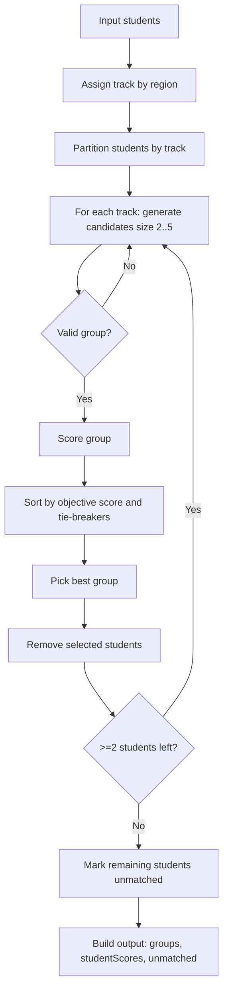
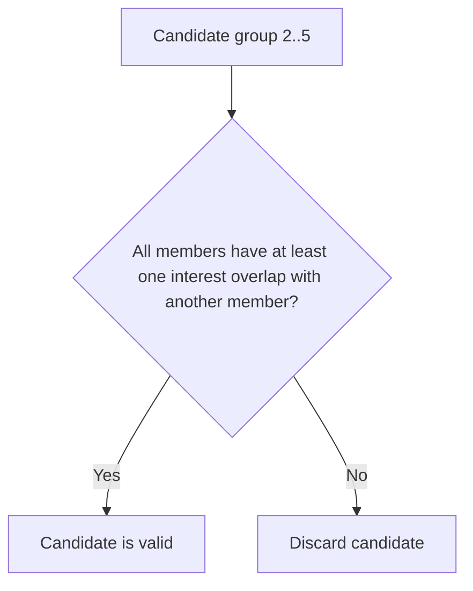
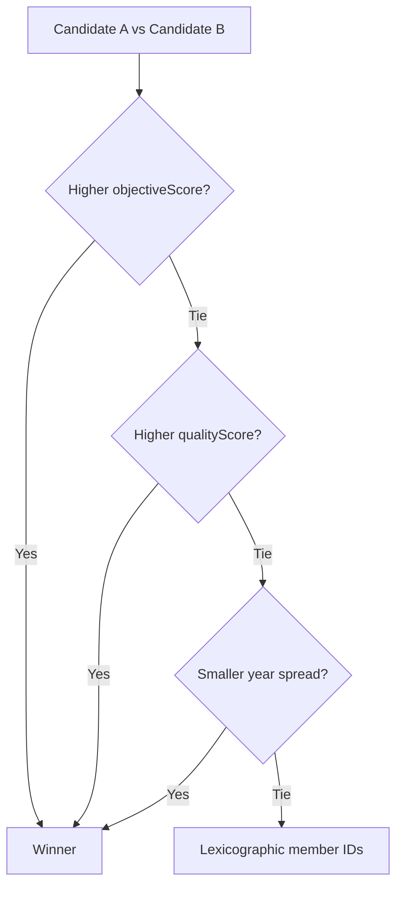
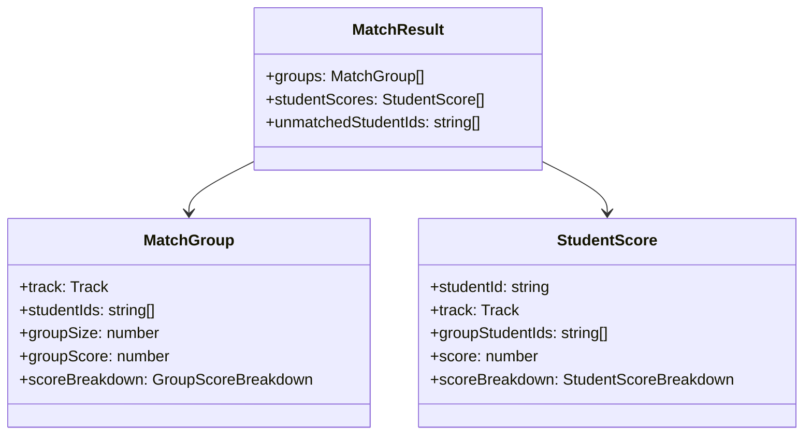

# Student Auto-Grouping Algorithm

This document explains the logic implemented in `student.ts`.

## Goal

Automatically group students into groups of **2 to 5** members with:

1. Strict **track isolation**
2. Mandatory **shared interests**
3. Quality-first scoring
4. Preference for larger groups only when quality remains high

## High-Level Flow (Mermaid)



## Input Model

Each student requires:

- `id: string`
- `region: string`
- `country: string`
- `timezoneOffsetHours: number`
- `yearLevel: number`
- `interests: string[]`

## Step 1: Track Assignment

`assignTrack(region)` maps students to:

- Region tracks: `AUS-NSW`, `AUS-QLD`, `AUS-VIC`, `AUS-WA`, `BRA`
- Otherwise: `GLOBAL`

Students can only be grouped with students in the **same track**.

## Step 2: Mandatory Group Eligibility

A candidate group is valid only if:

- Group size is between `2` and `5`
- Every student shares at least one interest with at least one other student in the same group (pairwise-overlap rule)

If this mandatory interest rule fails, the candidate is discarded.



## Step 3: Group Scoring

Base score is `100`.

`qualityScore = clamp(100 - penalties, 0, 100)`

### Region Track Penalties (`AUS-*`, `BRA`)

- Year-level penalty only
- For each pair in the group: `8 * abs(yearLevelA - yearLevelB)`
- Group year penalty is the average across all pairs

### Global Track Penalties (`GLOBAL`)

For each pair:

- Year penalty: `6 * abs(yearLevelA - yearLevelB)`
- If countries differ:
  - Country penalty: `12`
  - Timezone penalty: `min(18, 2 * abs(timezoneOffsetHoursA - timezoneOffsetHoursB))`

Group penalties are averages across all pairs.

### Size Bonus (objective selection only)

To prefer larger groups without overriding quality:

- Size 2: `+0`
- Size 3: `+3`
- Size 4: `+5`
- Size 5: `+6`

`objectiveScore = qualityScore + sizeBonus` (capped to `106`)

`groupScore` in output remains `qualityScore` (0 to 100).

```mermaid
flowchart TD
    A[Start with base 100] --> B{Track type}
    B -- Region --> C[Apply year penalties only]
    B -- Global --> D[Apply year penalties]
    D --> E{Same country?}
    E -- Yes --> F[No country/timezone penalty]
    E -- No --> G[Add country penalty + timezone penalty]
    C --> H[Average pair penalties]
    F --> H
    G --> H
    H --> I[qualityScore = clamp(100 - totalPenalty)]
    I --> J[objectiveScore = qualityScore + sizeBonus]
```

## Step 4: Group Formation Strategy

For each track independently:

1. Generate all valid candidate groups of size `2..5`
2. Score each candidate
3. Pick the best candidate
4. Remove selected students
5. Repeat until no strict valid candidate remains

If no valid candidate remains for a track, all remaining students in that track are returned as unmatched.

For each unmatched student, the algorithm now also returns a reason object with score explanation.

## Deterministic Tie-Breakers

Candidates are sorted by:

1. Higher `objectiveScore`
2. Higher `qualityScore`
3. Smaller year spread (`max(yearLevel) - min(yearLevel)`)
4. Stable lexicographic member ID key

This guarantees repeatable output.



## Per-Student Scoring

For each grouped student, `scoreStudentInGroup` computes student-level penalties against their peers in the group:

- Region track: year-level penalties only
- Global track: year + country mismatch + timezone (when country differs)

Student score:

- `score = clamp(100 - studentPenalties, 0, 100)`

## Output Shape

`buildGroups(students)` returns:

- `groups[]`
  - `track`
  - `studentIds`
  - `groupSize`
  - `groupScore`
  - `scoreBreakdown`
- `studentScores[]`
  - one record per grouped student
- `unmatchedStudentIds[]`
- `unmatchedStudentReasons[]`
  - `studentId`
  - `track`
  - `reasonCode`
  - `reason`
  - `compatibleStudentIdsInTrack`
  - `score` (always `0` for unmatched)
  - `scoreBreakdown` (`baseScore: 100`, `totalPenalty: 100`, explanation text)

`unmatchedStudentIds` contains students who could not be matched while preserving mandatory shared-interest rules.

Reason codes:

- `NO_SHARED_INTEREST_IN_TRACK`: student has no shared-interest peer in their track.
- `LEFTOVER_AFTER_GROUP_SELECTION`: student had shared-interest peers, but no valid 2-5 grouping remained after higher-score selections.



## Complexity Notes

- Candidate generation is combinational (`nC2 + nC3 + nC4 + nC5` per track).
- This is acceptable for moderate track sizes and provides high-quality grouping.
- For very large cohorts, a heuristic/beam-search variant can be introduced later.
