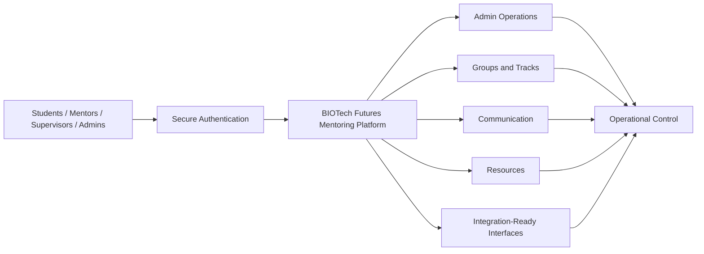

# Project Expected Outcomes

## Purpose

This document summarises the expected project outcomes for presentation to the client, based on the current understanding of the BIOTech Futures mentoring platform and the intended role of Workstream 2.

It is written in client-facing language and focuses on:

- what the project is expected to deliver
- what practical capability the client should gain
- what Workstream 2 is expected to contribute
- how success should be measured at a high level

## Project Outcome Statement

The expected outcome of this project is a secure, supportable, web-based mentoring platform that can replace the current Chronus-based experience for BIOTech Futures and provide a foundation for future program growth.

At the end of the project, the client should have:

- a backend platform that supports real program operations
- a web experience for students, mentors, supervisors, and administrators
- secure authentication and role-based permissions
- structured program data for users, groups, resources, chat, and events
- administrative capability to form, manage, and adjust mentoring groups
- a documented system that can be handed over and extended in future phases

## Expected Whole-of-Project Outcomes

### 1. A replacement mentoring platform foundation

The project should deliver the core platform needed to move away from the current Chronus dependency for day-to-day mentoring program operations.

Expected result:

- BIOTech Futures has its own mentoring platform foundation, aligned to its own brand, process, and data needs

### 2. Secure access for all platform users

The platform should support secure sign-in using password-based authentication, with access governed by role and program scope. If the client later chooses to retain email OTP as a secondary option, it should be treated as an additional access path rather than the only login method.

Expected result:

- students, mentors, supervisors, and administrators can access the right features without sharing a single undifferentiated admin model

### 3. Structured mentoring program operations

The platform should support the core operating model of the program:

- user onboarding
- tracks and regions
- mentoring groups
- group communication
- resource visibility
- event participation
- account lifecycle management

Expected result:

- the platform becomes a usable operational system, not only a prototype or static portal

### 4. Administrative control and flexibility

The system should support administrators in managing the mentoring program over time, not just at initial setup.

Expected result:

- administrators can create groups, review assignments, manage account states, and handle reassignment needs without requiring engineering intervention for every change

### 5. Data interface readiness

The platform should be ready to support future user import/export once the client decides the external data approach, while event management itself is handled inside the platform.

Expected result:

- the system has a documented and supportable path for future data exchange without depending on manual ad hoc workarounds

### 6. A handover-ready backend and API foundation

The backend should be documented, testable, and understandable for future maintainers.

Expected result:

- the client receives not just code, but a supportable platform foundation with a clear handover path

## Expected Outcomes For Workstream 2

Workstream 2 is expected to deliver the backend and API capability that enables the rest of the platform.

### Workstream 2 outcome 1: secure identity and access foundation

Workstream 2 should deliver:

- password-based authentication
- password setup, reset, and recovery support
- user account lifecycle support
- role-based access control
- safe backend enforcement of permissions

Client impact:

- the platform can be trusted to separate access appropriately between students, mentors, supervisors, and administrators

### Workstream 2 outcome 2: a stable backend data model

Workstream 2 should deliver a backend schema and API layer that supports:

- users and profiles
- tracks and group structures
- group membership
- resources and role-based visibility
- chat messages and related data
- events and certificates where relevant to mentoring operations

Client impact:

- the backend can support real program workflows rather than temporary demo data structures

### Workstream 2 outcome 3: core operational APIs for the platform

Workstream 2 should supply the backend interfaces used by the frontend and by admin automation workflows.

This includes APIs for:

- user/profile retrieval and update
- group and member retrieval
- group messaging
- resource retrieval and upload
- administrative workflows and status management
- documented data import/export interface planning

Client impact:

- Workstream 1 and Workstream 3 can build against a consistent backend contract

### Workstream 2 outcome 4: support for admin workflows

Workstream 2 should provide backend support for the program’s key admin activities:

- group formation support
- mentor allocation and reassignment support
- account activation/deactivation
- role-aware access to communications and resources

Client impact:

- administrators gain operational leverage and reduce manual coordination effort

### Workstream 2 outcome 5: handover and future data-interface readiness

Workstream 2 should leave the backend in a state where:

- future user import/export can be implemented in a structured way once the client finalises that requirement
- the system can be deployed and operated with confidence
- future teams can continue the work without re-discovering architecture decisions

Client impact:

- the project creates a long-term foundation, not just a semester-bound deliverable

## What Success Looks Like For The Client

From the client’s perspective, success should look like this:

- a user can sign in securely using the approved authentication flow
- the platform recognises different user roles and restricts access appropriately
- mentoring groups can be represented and managed in the system
- group communication and resource access work in a way that reflects the program structure
- administrators can manage key program operations with less manual overhead
- the backend is stable enough to support the UI and automation workstreams
- the system is documented well enough to support handover and future enhancement

## Practical Benefits To The Client

If the project is delivered successfully, the client should gain:

- greater control over the mentoring platform and its future direction
- reduced reliance on a third-party platform that does not fully fit the program
- clearer ownership of data and workflows
- improved administrative efficiency
- a more extensible technical foundation for future cohorts or vendors

## Expected Limitations And Realistic Phase Boundaries

Not every desirable feature needs to be fully mature in the same phase.

The realistic expectation for this project is that the team delivers the core operational backend and API foundation first, while more advanced features may be handled as later enhancements.

Features more likely to be treated as later-phase or stretch items include:

- advanced analytics dashboards
- embedded video conferencing
- calendar scheduling integrations
- highly sophisticated matching logic beyond a deterministic, reviewable first version

## High-Level Outcome Diagram

## Suggested Client-Facing Summary

The expected outcome of this project is a BIOTech Futures mentoring platform foundation that is secure, usable, and supportable. The platform should enable role-based access, structured mentoring groups, communication, resource access, and core administrative workflows, while also providing a backend and API layer that can support future integrations and future development. In practical terms, this means the client should finish the project with a credible replacement foundation for Chronus, not just a prototype, and with documentation that makes the system maintainable after handover.
