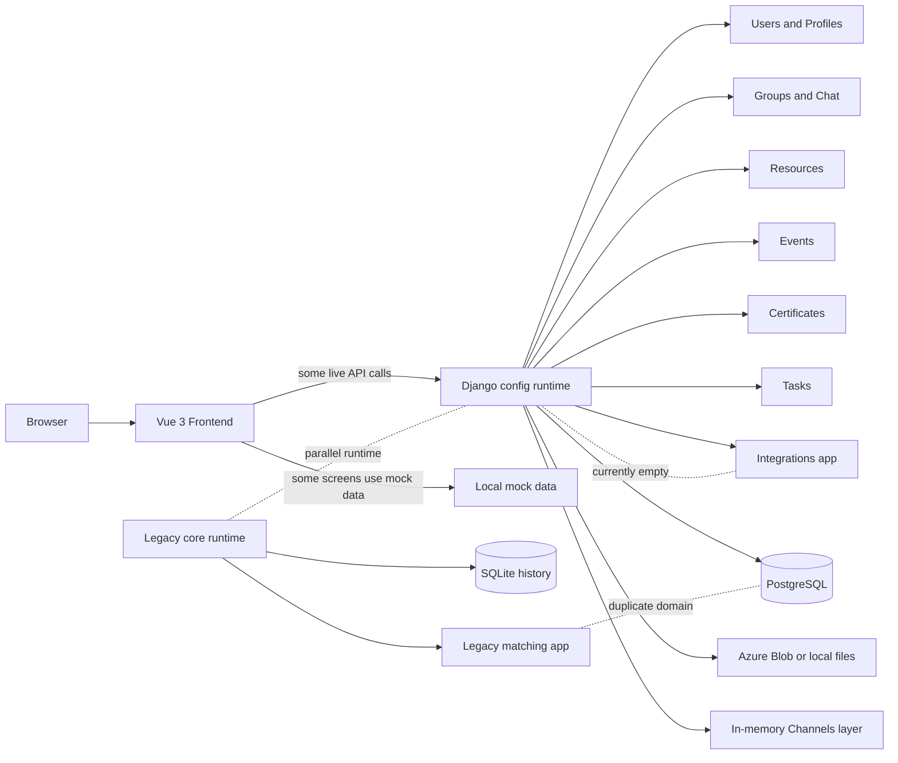
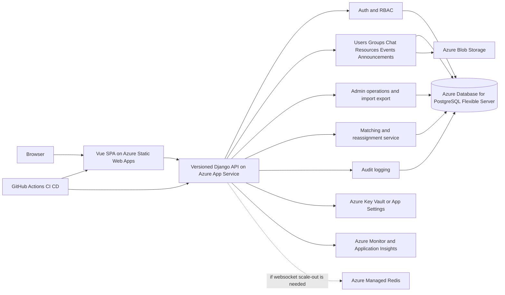

# Client Presentation Proposal: Database, Architecture, Stabilisation, and Feature-Team Delivery

## Purpose

This document is for the next client presentation and for coordination with the other two student groups.

It replaces the earlier workstream framing with a feature-team delivery model across three groups of eight members each.

It covers:

- the current database schema and its main problems
- the proposed database schema and why it should change
- the current system architecture and its main problems
- the proposed production-ready architecture for Azure hosting
- current blockers across frontend, backend, and matching automation
- the minimum resource footprint required to deliver safely
- the recommended feature split across the three groups
- scope boundaries, sign-off points, timeline, and delivery safeguards

Assessment date: March 26, 2026.

Branch/runtime context used for this proposal:

- active Django runtime: `backend/config`
- legacy Django runtime still present: `backend/core`
- frontend: Vue 3 + Vite
- local development branch has moved from SQLite to PostgreSQL in `config.settings_local`

Validation performed on March 26, 2026:

- `python manage.py check --settings=config.settings_local` passed
- `.venv/bin/python manage.py showmigrations --settings=config.settings_local` confirmed that the active apps are fully migrated in local PostgreSQL
- Django schema introspection was run against local PostgreSQL to verify the current table and column shape used in this document
- DB-backed test execution is still not a clean delivery gate yet and needs separate stabilisation

That means the current-schema sections below are now based first on the migration-applied PostgreSQL schema and only secondarily on the current model files. Local database automation is still not fully stabilised, but the schema review is now grounded in what Django/PostgreSQL has actually materialised.

## Executive Summary

The codebase already has a usable core:

- Django 5.2 + DRF backend
- custom user model and profile tables
- groups, chat, events, resources, certificates, and tasks modules
- a Vue frontend
- PostgreSQL as the intended production database

However, the platform is not yet production-ready.

The core problems are structural rather than cosmetic:

1. the database schema mixes good relational modelling with non-deterministic and duplicated design choices
2. the system architecture has two competing runtime histories (`config` and `core`)
3. the frontend is still partially disconnected from live APIs
4. the matching capability exists in legacy form but is not integrated into the active runtime
5. secrets and operational settings are still unsafe for Azure production

The recommended strategy is:

1. stabilise the platform first
2. lock the schema and architecture
3. split the delivery by features, not by historical workstreams
4. give our group ownership of the identity, governance, and platform-control feature bundle

## 1. Database Schema

### 1.1 Current Schema Summary

The current schema contains the right broad domains, but the boundaries are not clean.

Implemented core domains in the active runtime:

- Django auth-backed custom users, including framework auth columns on the `users` table
- users and profile tables
- roles and role assignment history
- countries, states, tracks, groups, and group membership
- chat messages and attachments
- resources and resource visibility by role
- events and event invites
- certificates
- sessions and alerts
- tasks and workshops

Important gaps or misfits relative to the project plan:

- no first-class announcements schema in the active runtime
- no first-class audit log table
- no explicit admin scope model for local admin vs global admin
- no first-class matching run or matching recommendation tables in the active runtime
- legacy `matching` app duplicates student, mentor, group, and interest concepts outside the main schema

For readability, the ERD below focuses on the main MVP entities and the main problem areas.

Accuracy note:

- the current-state ERD below is intentionally simplified, but it is now aligned to the migration-applied PostgreSQL schema rather than only to `models.py`
- framework auth columns on `users` are now shown because they are part of the live runtime schema
- generated or awkward live column names such as `mentor_profile.Institution`, `resources.uploader_user_id_id`, and `events."event_image(IMG)"` are kept as-is where practical so the ERD reflects the runtime database
- the diagram still omits lower-priority runtime tables such as `tasks`, `workshops`, `emailing`, and Django internal framework tables outside the custom `users` table
- the proposed ERD later in this document is a target-state design and includes entities that do not yet exist in current migrations

### 1.2 Current Schema ERD

```mermaid
erDiagram
    USERS {
        bigint id PK
        varchar password
        datetime last_login
        boolean is_superuser
        varchar first_name
        varchar last_name
        boolean is_staff
        boolean is_active
        datetime date_joined
        varchar email UK
        boolean status
        bigint state_id FK
        bigint track_id FK
    }

    ADMIN_PROFILE {
        bigint admin_id PK, FK
    }

    ROLES {
        bigint id PK
        varchar role_name UK
    }

    ROLE_ASSIGNMENT_HISTORY {
        bigint id PK
        bigint user_id FK
        bigint role_id FK
        datetime valid_from
        datetime valid_to
    }

    STUDENT_PROFILE {
        bigint user_id PK, FK
        varchar pg_first_name
        varchar pg_last_name
        boolean parent_guardian_flag
        varchar school_name
        varchar year_lvl
        boolean has_join_permission
        bigint supervisor_id FK
        bigint interest_id FK
        varchar joinperm_responseID
    }

    STUDENT_INTEREST {
        bigint id PK
        bigint interest_id FK
        bigint user_id FK
    }

    MENTOR_PROFILE {
        bigint user_id PK, FK
        bigint background_id FK
        varchar Institution
        varchar mentor_reason
        int max_grp_cnt
    }

    SUPERVISOR_PROFILE {
        bigint user_id PK, FK
        varchar school_name
    }

    BACKGROUND {
        bigint id PK
        varchar background_desc_unique_field UK
    }

    AREAS_OF_INTEREST {
        bigint id PK
        varchar interest_desc
    }

    RELATIONSHIP_TYPE {
        bigint relationship_type_id PK
        varchar relationship_type UK
    }

    STUDENT_SUPERVISOR {
        bigint id PK
        bigint relationship_type_id FK
        bigint student_user_id FK
        bigint supervisor_user_id FK
    }

    COUNTRIES {
        bigint id PK
        varchar country_name
    }

    TRACKS {
        bigint id PK
        varchar track_name UK
        bigint state_id FK
    }

    COUNTRY_STATES {
        bigint id PK
        bigint country_id FK
        varchar state_name
    }

    GROUPS {
        bigint id PK
        varchar group_name
        bigint track_id FK
        datetime creation_datetime
        boolean deleted_flag
        datetime deleted_datetime
    }

    GROUP_MEMBERS {
        bigint id PK
        bigint group_id FK
        bigint user_id FK
    }

    MESSAGES {
        bigint id PK
        bigint sender_user_id FK
        bigint group_id FK
        text message_text
        datetime sent_datetime
        boolean deleted_flag
    }

    MESSAGE_ATTACHMENTS {
        bigint id PK
        varchar attachment_id UK
        varchar attachment_filename
        bigint message_id FK
    }

    MESSAGE_RESOURCES {
        bigint id PK
        bigint message_id FK
        bigint resource_id FK
    }

    RESOURCE_TYPES {
        bigint id PK
        varchar type_name UK
        varchar type_description
    }

    RESOURCES {
        bigint id PK
        bigint uploader_user_id_id FK
        bigint resource_type_id FK
        varchar resource_name
        varchar resource_description
        datetime upload_datetime
        boolean deleted_flag
        datetime deleted_datetime
    }

    RESOURCE_ROLES {
        bigint id PK
        bigint resource_id FK
        bigint role_id FK
    }

    EVENTS {
        bigint id PK
        varchar event_name
        varchar description
        bigint host_user_id FK
        datetime start_datetime
        datetime ends_datetime
        varchar location
        varchar humanitix_link
        boolean deleted_flag
        datetime deleted_datetime
        varchar event_image(IMG)
        boolean is_virtual
    }

    EVENT_INVITE {
        bigint id PK
        bigint event_id FK
        bigint user_id FK
        datetime sent_datetime
        boolean attendance_status
        boolean rsvp_status
    }

    EVENT_TARGET_GROUP {
        bigint id PK
        bigint event_id FK
        bigint group_id FK
    }

    EVENT_TARGET_ROLE {
        bigint id PK
        bigint event_id FK
        bigint role_id FK
    }

    EVENT_TARGET_TRACK {
        bigint id PK
        bigint event_id FK
        bigint track_id FK
    }

    CERTIFICATE_TYPE {
        bigint id PK
        varchar certificate_type UK
        boolean requires_number
        boolean requires_expiry
    }

    MENTOR_CERTIFICATE {
        bigint id PK
        bigint mentor_profile_id FK
        bigint certificate_type_id FK
        varchar certificate_number
        varchar issued_by
        date issued_at
        date expires_at
        varchar file_url
        boolean verified
    }

    SESSIONS {
        bigint id PK
        bigint user_id FK
        datetime access_datetime
        boolean isLoggedin
    }

    ALERTS {
        bigint id PK
        datetime alert_timestamp
        varchar error_reason
        boolean resolved
        bigint session_id FK
    }

    MATCHING_STUDENT {
        bigint id PK
        varchar email UK
        varchar track
    }

    MATCHING_MENTOR {
        bigint id PK
        varchar email UK
        varchar track
    }

    MATCHING_GROUP {
        bigint id PK
        varchar name
        varchar track
    }

    USERS ||--o{ ROLE_ASSIGNMENT_HISTORY : assigned
    ROLES ||--o{ ROLE_ASSIGNMENT_HISTORY : typed
    USERS ||--|| ADMIN_PROFILE : has
    COUNTRIES ||--o{ COUNTRY_STATES : contains
    TRACKS ||--o{ USERS : assigned
    COUNTRY_STATES ||--o{ USERS : duplicated_on
    COUNTRY_STATES ||--o{ TRACKS : contains
    TRACKS ||--o{ GROUPS : contains
    GROUPS ||--o{ GROUP_MEMBERS : has
    USERS ||--o{ GROUP_MEMBERS : belongs
    USERS ||--|| STUDENT_PROFILE : has
    USERS ||--|| MENTOR_PROFILE : has
    USERS ||--|| SUPERVISOR_PROFILE : has
    BACKGROUND ||--o{ MENTOR_PROFILE : classifies
    AREAS_OF_INTEREST ||--o{ STUDENT_PROFILE : primary_interest
    USERS ||--o{ STUDENT_INTEREST : links
    AREAS_OF_INTEREST ||--o{ STUDENT_INTEREST : categorizes
    RELATIONSHIP_TYPE ||--o{ STUDENT_SUPERVISOR : types
    USERS ||--o{ STUDENT_SUPERVISOR : student_links
    SUPERVISOR_PROFILE ||--o{ STUDENT_SUPERVISOR : supervisor_links
    RESOURCE_TYPES ||--o{ RESOURCES : classifies
    GROUPS ||--o{ MESSAGES : contains
    USERS ||--o{ MESSAGES : sends
    MESSAGES ||--o{ MESSAGE_ATTACHMENTS : attaches
    MESSAGES ||--o{ MESSAGE_RESOURCES : links
    RESOURCES ||--o{ MESSAGE_RESOURCES : shared_in
    USERS ||--o{ RESOURCES : uploads
    RESOURCES ||--o{ RESOURCE_ROLES : visible_to
    ROLES ||--o{ RESOURCE_ROLES : allowed
    USERS ||--o{ EVENTS : hosts
    EVENTS ||--o{ EVENT_INVITE : invites
    USERS ||--o{ EVENT_INVITE : receives
    EVENTS ||--o{ EVENT_TARGET_GROUP : targets_groups
    GROUPS ||--o{ EVENT_TARGET_GROUP : receives_events
    EVENTS ||--o{ EVENT_TARGET_ROLE : targets_roles
    ROLES ||--o{ EVENT_TARGET_ROLE : receives_events
    EVENTS ||--o{ EVENT_TARGET_TRACK : targets_tracks
    TRACKS ||--o{ EVENT_TARGET_TRACK : receives_events
    MENTOR_PROFILE ||--o{ MENTOR_CERTIFICATE : owns
    CERTIFICATE_TYPE ||--o{ MENTOR_CERTIFICATE : typed
    USERS ||--o{ SESSIONS : has
    SESSIONS ||--o{ ALERTS : raises
```



### 1.2A Current vs Proposed Naming Alignment

The earlier drafts of this document mixed actual current table names with future-state names. The mapping below is now the intended interpretation across both schema documents.

| Current active-runtime table | Proposed target-state table | Purpose of the change |
| --- | --- | --- |
| `role_assignment_history` | `USER_ROLE_ASSIGNMENT` | preserve temporal role history, but make the business concept explicit |
| `group_members` | `GROUP_MEMBERSHIP` | add membership lifecycle and optional in-group role |
| `resource_roles` | `RESOURCE_AUDIENCE` | model role- and track-scoped resource visibility more clearly |
| `sessions` | `USER_SESSION` | move from login snapshot to full session lifecycle |
| `alerts` | `ALERT` | keep the alert concept, but tie it to the richer session model |
| legacy `matching_student`, `matching_mentor`, `matching_group` | `MATCH_RUN` and `MATCH_RECOMMENDATION` | retire the parallel matching schema and persist outcomes in the main runtime |
| legacy `matching_mentoravailability` | `MENTOR_AVAILABILITY` | move mentor timetable availability into the canonical runtime for allocation workflows |
| no current table | `ADMIN_SCOPE` | required to enforce local admin vs global admin boundaries |
| no current table | `ANNOUNCEMENTS`, `ANNOUNCEMENT_AUDIENCE`, `AUDIT_LOG` | missing governance and communication capabilities in the active runtime |

### 1.3 What Is Wrong With the Current Schema

The issues below were rechecked against the migration-applied PostgreSQL schema, not just the model files.

#### A. Time-relative `CHECK` constraints are in the schema

Examples currently exist on:

- groups creation timestamp
- resource upload timestamp
- event invite timestamp
- session access timestamp
- certificate verification vs expiry

Why this is wrong:

- a database `CHECK` should enforce a deterministic row invariant
- these rules depend on wall-clock time, so their truth changes without the row changing
- that makes the schema brittle across databases, restores, and migrations

This is not just a SQLite issue. PostgreSQL accepts these patterns more readily, but they are still not good relational design.

#### B. Vendor-specific schema logic exists in model metadata

`connection.vendor` is used in the certificates model to change constraints depending on database backend.

Why this is wrong:

- the migration history should be the source of truth
- model metadata should not silently define one schema on SQLite and another on PostgreSQL
- CI, local development, and production can drift

Important nuance after the PostgreSQL review:

- the active PostgreSQL schema currently does contain the certificate expiry check because that migration has been applied
- the recommendation still stands because `connection.vendor` in model metadata remains a schema-drift risk for future migration generation and local development

#### C. Geography is duplicated on `users`

The current user row stores both:

- `track_id`
- `state_id`

But track already implies state.

Risk:

- a user can point to a track in one state and a direct state in another
- the schema does not enforce consistency between the two

#### D. Student interests are modelled twice

The schema currently uses:

- `student_profile.interest_id`
- `student_interest(user_id, interest_id)`

That creates two competing sources of truth.

#### E. Session modelling is too weak for production

The current session table stores:

- `access_datetime`
- `isLoggedin`

That is not enough for:

- session expiry
- logout tracking
- revocation
- multi-device support
- reliable auditability

#### F. Soft delete is not aligned with uniqueness

Some entities soft-delete rows but still use unconditional uniqueness.

That means deleted historical rows can block valid reuse of names or codes.

PostgreSQL has better options here: partial unique indexes for active rows only.

#### G. Important MVP entities are missing or split

Relative to the updated project plan, the active runtime still lacks:

- announcements
- audit logs
- admin scope boundaries
- matching-run persistence
- matching-result persistence

At the same time, the legacy `matching` app duplicates student, mentor, group, and track concepts outside the active runtime.

#### H. Model intent and PostgreSQL reality are not perfectly the same thing

The live PostgreSQL schema shows several implementation details that do not read cleanly from `models.py` alone:

- the `users` table includes inherited Django auth columns in addition to the domain-specific columns
- some live column names are awkward because of historical `db_column` choices, for example `Institution`, `uploader_user_id_id`, and `event_image(IMG)`
- current schema review should therefore use migration-applied PostgreSQL as the source of truth for "what exists now", and use model files mainly to understand intended direction

### 1.4 How These Problems Happened

The current state appears to be the result of several overlapping causes:

1. the codebase evolved through multiple project phases instead of one governed schema roadmap
2. SQLite and PostgreSQL behavior diverged for too long
3. workflow rules were pushed into database constraints instead of application validation
4. the legacy matching module evolved as a parallel data model instead of a service inside the main domain
5. the schema was extended app by app without a single, signed-off canonical ERD

### 1.5 Proposed Database Schema

The proposed design keeps the current domain where it already makes sense, but corrects the model to be Azure-hosted and production-ready.

Design principles:

- one canonical schema under the active Django runtime
- deterministic database constraints only
- admin authority modelled explicitly
- soft-delete compatible uniqueness
- matching outputs persisted in the main schema
- one shared interest taxonomy used by both students and mentors
- mentor matching inputs modelled explicitly, including interest, capacity, and availability
- auditability as a first-class requirement
- no redundant geography or duplicated interest source of truth

### 1.5A Current vs Proposed Schema Summary

| Current | Proposed |
| --- | --- |
| `roles.role_name` stores role labels | `roles.slug` stores stable role keys like `student`, `mentor`, `local_admin`, `global_admin` |
| `role_assignment_history` is the current temporal role table | `user_role_assignment` remains temporal but is renamed as the canonical RBAC assignment model |
| `users.status` is effectively a simple active/inactive flag | `users.account_status` supports invite, pending, active, suspended lifecycle states |
| no explicit invite or activation timestamps on users | `users.invited_at` and `users.activated_at` support proper onboarding and auditability |
| `users` stores both `track_id` and `state_id` | keep `track_id`, derive state from track to avoid redundant geography |
| no explicit local-vs-global admin scope model | `admin_scope` defines whether an admin is global or restricted to a track or track subtree |
| `tracks.track_name` is the main identifier | `tracks.track_code` becomes the stable business identifier |
| `student_profile.interest_id` and `student_interest` both represent interests | keep one normalized interest model via `student_interest` and mark primary with `is_primary` |
| `mentor_profile.background_id` and `background` classify mentors | remove mentor background from the target matching model and use shared interest data plus normal profile attributes instead |
| mentors do not have normalized interests in the active runtime | add `mentor_interest` using the same `areas_of_interest` catalog used by students |
| `mentor_profile.max_grp_cnt` exists with legacy naming | keep mentor capacity explicitly as `max_group_count` in the target model |
| mentor availability exists only in the legacy `matching` module | add `mentor_availability` to the canonical runtime to support timetable allocation and reassignment |
| `student_profile` uses inconsistent field names like `year_lvl` and `joinperm_responseID` | normalized field names such as `year_level` and `join_permission_response_id` |
| `group_members` is a simple membership join table | `group_membership` includes lifecycle fields like `joined_at`, `left_at`, and optional `membership_role` |
| `groups` uses `creation_datetime`, `deleted_flag`, `deleted_datetime` | simplified lifecycle fields like `created_at` and `deleted_at` |
| `messages` supports sent/deleted state only | `messages` adds lifecycle clarity with `sent_at`, `edited_at`, `deleted_at` |
| resources are mainly typed and role-filtered via `resource_roles` | resources gain explicit `track_id`, `visibility_scope`, and `resource_audience` for role and track targeting |
| `resource_roles` only links a resource to roles | `resource_audience` supports both role-based and track-based visibility |
| current events are split across `events`, `event_invite`, and targeting tables | target model centers on scoped events plus clearer RSVP tracking |
| `event_invite` uses boolean `attendance_status` and `rsvp_status` | `event_rsvp` uses a clearer response-state model with `rsvp_status` and `responded_at` |
| no first-class announcements schema | `announcements` and `announcement_audience` support bulk communications and scoped visibility |
| `mentor_certificate` uses a simple `verified` boolean | add `verified_at` and `verified_by_user_id` for proper verification audit trail |
| `sessions` stores `access_datetime` and `isLoggedin` | `user_session` models real session lifecycle with `created_at`, `last_activity_at`, `expires_at`, `ended_at`, `revoked_at` |
| `alerts` exists but is tied to the weaker session model | `alert` remains but hangs off the richer session lifecycle and includes clearer audit timestamps |
| no first-class audit log | `audit_log` records actor, action, target entity, and before and after state |
| legacy `matching` app has separate `Student`, `Mentor`, `StudentGroup` schema | matching moves into the canonical runtime via `match_run` and `match_recommendation` |
| matching outcomes are not first-class persisted business records | proposed schema stores run metadata, rules snapshot, score, explanation, and acceptance outcome |
| time-based `Now()` `CHECK` constraints are embedded in multiple models | remove time-relative DB checks and enforce those rules in application logic |
| schema behavior changes by DB vendor in certificates via `connection.vendor` | remove vendor-conditional schema branching so migrations are environment-independent |
| soft deletes can conflict with unconditional uniqueness | use partial unique indexes so only active rows must be unique |

### 1.6 Proposed Schema ERD

This ERD is the target-state design. It is not the current migrated database.

```mermaid
erDiagram
    USERS {
        bigint id PK
        varchar email UK
        varchar first_name
        varchar last_name
        boolean is_active
        bigint track_id FK
        varchar account_status
        datetime invited_at
        datetime activated_at
    }

    ROLES {
        bigint id PK
        varchar slug UK
    }

    USER_ROLE_ASSIGNMENT {
        bigint id PK
        bigint user_id FK
        bigint role_id FK
        datetime valid_from
        datetime valid_to
    }

    ADMIN_SCOPE {
        bigint id PK
        bigint user_id FK
        bigint track_id FK
        boolean is_global
    }

    TRACKS {
        bigint id PK
        varchar track_code UK
        bigint state_id FK
    }

    COUNTRIES {
        bigint id PK
        varchar country_name UK
    }

    COUNTRY_STATES {
        bigint id PK
        bigint country_id FK
        varchar state_name
    }

    SUPERVISOR_PROFILE {
        bigint user_id PK, FK
        varchar school_name
    }

    MENTOR_PROFILE {
        bigint user_id PK, FK
        varchar institution
        int max_group_count
    }

    STUDENT_PROFILE {
        bigint user_id PK, FK
        bigint supervisor_user_id FK
        varchar school_name
        smallint year_level
        boolean join_permission_received
        varchar join_permission_response_id
    }

    AREAS_OF_INTEREST {
        bigint id PK
        varchar interest_desc UK
    }

    STUDENT_INTEREST {
        bigint id PK
        bigint student_user_id FK
        bigint interest_id FK
        boolean is_primary
    }

    MENTOR_INTEREST {
        bigint id PK
        bigint mentor_user_id FK
        bigint interest_id FK
    }

    MENTOR_AVAILABILITY {
        bigint id PK
        bigint mentor_user_id FK
        smallint weekday
        time start_time
        time end_time
    }

    GROUPS {
        bigint id PK
        varchar group_name
        bigint track_id FK
        datetime created_at
        datetime deleted_at
    }

    GROUP_MEMBERSHIP {
        bigint id PK
        bigint group_id FK
        bigint user_id FK
        varchar membership_role
        datetime joined_at
        datetime left_at
    }

    MESSAGES {
        bigint id PK
        bigint group_id FK
        bigint sender_user_id FK
        text message_text
        datetime sent_at
        datetime edited_at
        datetime deleted_at
    }

    RESOURCES {
        bigint id PK
        bigint uploader_user_id FK
        bigint track_id FK
        varchar visibility_scope
        datetime uploaded_at
        datetime deleted_at
    }

    RESOURCE_AUDIENCE {
        bigint id PK
        bigint resource_id FK
        bigint role_id FK
        bigint track_id FK
    }

    EVENTS {
        bigint id PK
        bigint host_user_id FK
        bigint track_id FK
        varchar event_type
        datetime start_at
        datetime ends_at
    }

    EVENT_RSVP {
        bigint id PK
        bigint event_id FK
        bigint user_id FK
        varchar rsvp_status
        datetime responded_at
    }

    ANNOUNCEMENTS {
        bigint id PK
        bigint author_user_id FK
        bigint track_id FK
        varchar visibility_scope
        datetime published_at
        datetime archived_at
    }

    ANNOUNCEMENT_AUDIENCE {
        bigint id PK
        bigint announcement_id FK
        bigint role_id FK
        bigint track_id FK
    }

    CERTIFICATE_TYPE {
        bigint id PK
        varchar name UK
        boolean requires_number
        boolean requires_expiry
    }

    MENTOR_CERTIFICATE {
        bigint id PK
        bigint mentor_profile_id FK
        bigint certificate_type_id FK
        varchar certificate_number
        varchar issued_by
        date issued_at
        date expires_at
        varchar file_url
        datetime verified_at
        bigint verified_by_user_id FK
    }

    USER_SESSION {
        bigint id PK
        bigint user_id FK
        datetime created_at
        datetime last_activity_at
        datetime expires_at
        datetime ended_at
        datetime revoked_at
    }

    ALERT {
        bigint id PK
        bigint session_id FK
        datetime created_at
        varchar error_reason
        boolean resolved
        datetime resolved_at
    }

    AUDIT_LOG {
        bigint id PK
        bigint actor_user_id FK
        varchar entity_type
        bigint entity_id
        varchar action
        jsonb before_state
        jsonb after_state
        datetime created_at
    }

    MATCH_RUN {
        bigint id PK
        bigint initiated_by_user_id FK
        bigint track_id FK
        varchar run_type
        jsonb rules_snapshot
        datetime created_at
    }

    MATCH_RECOMMENDATION {
        bigint id PK
        bigint match_run_id FK
        bigint group_id FK
        bigint mentor_user_id FK
        numeric score
        jsonb explanation
        boolean accepted
    }

    TRACKS ||--o{ USERS : assigns
    USERS ||--o{ USER_ROLE_ASSIGNMENT : receives
    ROLES ||--o{ USER_ROLE_ASSIGNMENT : grants
    USERS ||--o{ ADMIN_SCOPE : governs
    TRACKS ||--o{ ADMIN_SCOPE : scoped_to
    COUNTRIES ||--o{ COUNTRY_STATES : contains
    COUNTRY_STATES ||--o{ TRACKS : contains
    USERS ||--|| SUPERVISOR_PROFILE : has
    USERS ||--|| MENTOR_PROFILE : has
    AREAS_OF_INTEREST ||--o{ MENTOR_INTEREST : categorizes
    MENTOR_PROFILE ||--o{ MENTOR_INTEREST : chooses
    MENTOR_PROFILE ||--o{ MENTOR_AVAILABILITY : offers
    USERS ||--|| STUDENT_PROFILE : has
    SUPERVISOR_PROFILE ||--o{ STUDENT_PROFILE : supervises
    AREAS_OF_INTEREST ||--o{ STUDENT_INTEREST : categorizes
    STUDENT_PROFILE ||--o{ STUDENT_INTEREST : chooses
    TRACKS ||--o{ GROUPS : contains
    GROUPS ||--o{ GROUP_MEMBERSHIP : has
    USERS ||--o{ GROUP_MEMBERSHIP : joins
    GROUPS ||--o{ MESSAGES : contains
    USERS ||--o{ MESSAGES : sends
    USERS ||--o{ RESOURCES : uploads
    TRACKS ||--o{ RESOURCES : scopes
    RESOURCES ||--o{ RESOURCE_AUDIENCE : targets
    ROLES ||--o{ RESOURCE_AUDIENCE : visible_to
    TRACKS ||--o{ RESOURCE_AUDIENCE : filtered_to
    USERS ||--o{ EVENTS : hosts
    TRACKS ||--o{ EVENTS : scopes
    EVENTS ||--o{ EVENT_RSVP : tracks
    USERS ||--o{ EVENT_RSVP : responds
    USERS ||--o{ ANNOUNCEMENTS : authors
    TRACKS ||--o{ ANNOUNCEMENTS : scopes
    ANNOUNCEMENTS ||--o{ ANNOUNCEMENT_AUDIENCE : targets
    ROLES ||--o{ ANNOUNCEMENT_AUDIENCE : visible_to
    TRACKS ||--o{ ANNOUNCEMENT_AUDIENCE : filtered_to
    MENTOR_PROFILE ||--o{ MENTOR_CERTIFICATE : owns
    CERTIFICATE_TYPE ||--o{ MENTOR_CERTIFICATE : typed
    USERS ||--o{ MENTOR_CERTIFICATE : verifies
    USERS ||--o{ USER_SESSION : owns
    USER_SESSION ||--o{ ALERT : raises
    USERS ||--o{ AUDIT_LOG : performs
    USERS ||--o{ MATCH_RUN : starts
    MATCH_RUN ||--o{ MATCH_RECOMMENDATION : produces
    GROUPS ||--o{ MATCH_RECOMMENDATION : scores
    USERS ||--o{ MATCH_RECOMMENDATION : recommends
```



### 1.6A Proposed Schema DBML For dbdiagram.io

The DBML below represents the same target-state schema in a format that can be pasted directly into `dbdiagram.io`.

```dbml
Project workstream2_target_schema {
  database_type: 'PostgreSQL'
  Note: 'Target-state schema for the mentoring platform after backend stabilisation and schema recovery.'
}

Table users {
  id bigint [pk]
  email varchar(255) [unique, not null]
  first_name varchar(255) [not null]
  last_name varchar(255) [not null]
  is_active boolean [not null]
  track_id bigint [not null]
  account_status varchar(50) [not null]
  invited_at timestamp
  activated_at timestamp
}

Table roles {
  id bigint [pk]
  slug varchar(100) [unique, not null]
}

Table user_role_assignment {
  id bigint [pk]
  user_id bigint [not null]
  role_id bigint [not null]
  valid_from timestamp [not null]
  valid_to timestamp

  indexes {
    (user_id, role_id, valid_from) [unique]
  }
}

Table admin_scope {
  id bigint [pk]
  user_id bigint [not null]
  track_id bigint
  is_global boolean [not null]
}

Table countries {
  id bigint [pk]
  country_name varchar(255) [unique, not null]
}

Table country_states {
  id bigint [pk]
  country_id bigint [not null]
  state_name varchar(255) [not null]

  indexes {
    (country_id, state_name) [unique]
  }
}

Table tracks {
  id bigint [pk]
  track_code varchar(100) [unique, not null]
  state_id bigint [not null]
}

Table supervisor_profile {
  user_id bigint [pk]
  school_name varchar(255) [not null]
}

Table mentor_profile {
  user_id bigint [pk]
  institution varchar(255)
  max_group_count int [not null]
}

Table areas_of_interest {
  id bigint [pk]
  interest_desc varchar(255) [unique, not null]
}

Table student_profile {
  user_id bigint [pk]
  supervisor_user_id bigint
  school_name varchar(255)
  year_level smallint
  join_permission_received boolean [not null]
  join_permission_response_id varchar(255)
}

Table student_interest {
  id bigint [pk]
  student_user_id bigint [not null]
  interest_id bigint [not null]
  is_primary boolean [not null]
}

Table mentor_interest {
  id bigint [pk]
  mentor_user_id bigint [not null]
  interest_id bigint [not null]

  indexes {
    (mentor_user_id, interest_id) [unique]
  }
}

Table mentor_availability {
  id bigint [pk]
  mentor_user_id bigint [not null]
  weekday smallint [not null]
  start_time time [not null]
  end_time time [not null]

  indexes {
    (mentor_user_id, weekday, start_time, end_time) [unique]
  }
}

Table groups {
  id bigint [pk]
  group_name varchar(255) [not null]
  track_id bigint [not null]
  created_at timestamp [not null]
  deleted_at timestamp
}

Table group_membership {
  id bigint [pk]
  group_id bigint [not null]
  user_id bigint [not null]
  membership_role varchar(50)
  joined_at timestamp [not null]
  left_at timestamp
}

Table messages {
  id bigint [pk]
  group_id bigint [not null]
  sender_user_id bigint [not null]
  message_text text [not null]
  sent_at timestamp [not null]
  edited_at timestamp
  deleted_at timestamp
}

Table resources {
  id bigint [pk]
  uploader_user_id bigint [not null]
  track_id bigint
  visibility_scope varchar(50) [not null]
  uploaded_at timestamp [not null]
  deleted_at timestamp
}

Table resource_audience {
  id bigint [pk]
  resource_id bigint [not null]
  role_id bigint
  track_id bigint
}

Table events {
  id bigint [pk]
  host_user_id bigint
  track_id bigint
  event_type varchar(100)
  start_at timestamp [not null]
  ends_at timestamp [not null]
}

Table event_rsvp {
  id bigint [pk]
  event_id bigint [not null]
  user_id bigint [not null]
  rsvp_status varchar(50) [not null]
  responded_at timestamp
}

Table announcements {
  id bigint [pk]
  author_user_id bigint [not null]
  track_id bigint
  visibility_scope varchar(50) [not null]
  published_at timestamp [not null]
  archived_at timestamp
}

Table announcement_audience {
  id bigint [pk]
  announcement_id bigint [not null]
  role_id bigint
  track_id bigint
}

Table certificate_type {
  id bigint [pk]
  name varchar(255) [unique, not null]
  requires_number boolean [not null]
  requires_expiry boolean [not null]
}

Table mentor_certificate {
  id bigint [pk]
  mentor_profile_id bigint [not null]
  certificate_type_id bigint [not null]
  certificate_number varchar(255)
  issued_by varchar(255)
  issued_at date [not null]
  expires_at date
  file_url varchar(500)
  verified_at timestamp
  verified_by_user_id bigint
}

Table user_session {
  id bigint [pk]
  user_id bigint [not null]
  created_at timestamp [not null]
  last_activity_at timestamp
  expires_at timestamp [not null]
  ended_at timestamp
  revoked_at timestamp
}

Table alert {
  id bigint [pk]
  session_id bigint [not null]
  created_at timestamp [not null]
  error_reason varchar(255) [not null]
  resolved boolean [not null]
  resolved_at timestamp
}

Table audit_log {
  id bigint [pk]
  actor_user_id bigint
  entity_type varchar(100) [not null]
  entity_id bigint [not null]
  action varchar(100) [not null]
  before_state jsonb
  after_state jsonb
  created_at timestamp [not null]
}

Table match_run {
  id bigint [pk]
  initiated_by_user_id bigint [not null]
  track_id bigint
  run_type varchar(100) [not null]
  rules_snapshot jsonb
  created_at timestamp [not null]
}

Table match_recommendation {
  id bigint [pk]
  match_run_id bigint [not null]
  group_id bigint [not null]
  mentor_user_id bigint [not null]
  score decimal(10,4)
  explanation jsonb
  accepted boolean [not null]
}

Ref: user_role_assignment.user_id > users.id
Ref: user_role_assignment.role_id > roles.id
Ref: admin_scope.user_id > users.id
Ref: admin_scope.track_id > tracks.id
Ref: country_states.country_id > countries.id
Ref: tracks.state_id > country_states.id
Ref: users.track_id > tracks.id
Ref: supervisor_profile.user_id - users.id
Ref: mentor_profile.user_id - users.id
Ref: student_profile.user_id - users.id
Ref: student_profile.supervisor_user_id > supervisor_profile.user_id
Ref: student_interest.student_user_id > student_profile.user_id
Ref: student_interest.interest_id > areas_of_interest.id
Ref: mentor_interest.mentor_user_id > mentor_profile.user_id
Ref: mentor_interest.interest_id > areas_of_interest.id
Ref: mentor_availability.mentor_user_id > mentor_profile.user_id
Ref: groups.track_id > tracks.id
Ref: group_membership.group_id > groups.id
Ref: group_membership.user_id > users.id
Ref: messages.group_id > groups.id
Ref: messages.sender_user_id > users.id
Ref: resources.uploader_user_id > users.id
Ref: resources.track_id > tracks.id
Ref: resource_audience.resource_id > resources.id
Ref: resource_audience.role_id > roles.id
Ref: resource_audience.track_id > tracks.id
Ref: events.host_user_id > users.id
Ref: events.track_id > tracks.id
Ref: event_rsvp.event_id > events.id
Ref: event_rsvp.user_id > users.id
Ref: announcements.author_user_id > users.id
Ref: announcements.track_id > tracks.id
Ref: announcement_audience.announcement_id > announcements.id
Ref: announcement_audience.role_id > roles.id
Ref: announcement_audience.track_id > tracks.id
Ref: mentor_certificate.mentor_profile_id > mentor_profile.user_id
Ref: mentor_certificate.certificate_type_id > certificate_type.id
Ref: mentor_certificate.verified_by_user_id > users.id
Ref: user_session.user_id > users.id
Ref: alert.session_id > user_session.id
Ref: audit_log.actor_user_id > users.id
Ref: match_run.initiated_by_user_id > users.id
Ref: match_run.track_id > tracks.id
Ref: match_recommendation.match_run_id > match_run.id
Ref: match_recommendation.group_id > groups.id
Ref: match_recommendation.mentor_user_id > users.id
```

### 1.7 Why Change the Schema

The proposed schema is better because it:

1. removes non-deterministic constraints from the database
2. removes environment-specific schema branching
3. makes local admin vs global admin explicit
4. makes announcements and matching results first-class entities instead of side ideas
5. keeps soft deletes compatible with reusable business identifiers
6. supports audit logging, which is essential for admin actions and security review
7. treats sessions as a lifecycle instead of a boolean snapshot
8. models mentor matching inputs directly through shared interests, explicit group capacity, and availability windows
9. gives the other feature teams a clearer, stable API contract

### 1.8 Best-Practice Fixes Required

Recommended schema actions:

1. remove all `Now()`-based `CHECK` constraints from model metadata and migrations
2. remove `connection.vendor` branching from model definitions
3. remove `users.state` and derive state from track
4. collapse student interests to one table, with `is_primary` if needed
5. replace `isLoggedin` with lifecycle timestamps
6. add partial unique indexes for active rows only
7. add `AUDIT_LOG`, `ADMIN_SCOPE`, `ANNOUNCEMENTS`, `MATCH_RUN`, and `MATCH_RECOMMENDATION`
8. formally retire or migrate the legacy `matching` schema into the main domain

Revalidation note:

- these recommendations were reviewed again against the applied PostgreSQL schema on March 26, 2026
- they still stand because they address live constraints, duplicated live entities, and missing live operational tables, not only model-file preferences

## 2. System Architecture

### 2.1 Current Architecture Summary

The current architecture is usable for development, but it is not yet a clean production system.

The active stack is:

- Vue 3 + Vite frontend
- Django 5.2 + DRF backend under `backend/config`
- PostgreSQL target database
- Azure Blob storage target
- Django Channels for chat

But the actual architecture is split by legacy history:

- `backend/core` is still present as an older runtime
- `matching` is installed but not mounted in the active `config` URL tree
- frontend screens still depend on mock data and hardcoded localhost URLs
- integrations module exists but is effectively empty
- the current backend settings hardcode secrets and keep `DEBUG = True`

### 2.2 Current Architecture Diagram



### 2.3 What Is Wrong With the Current Architecture

#### A. There is no single, enforced runtime truth

The project still contains:

- `config` as the active Django runtime
- `core` as a legacy runtime

That creates confusion in:

- setup
- migrations
- documentation
- matching integration
- testing

#### B. Frontend and backend contracts are not fully aligned

Current evidence:

- multiple frontend pages still load mock data
- frontend auth code hardcodes `http://localhost:8000`
- frontend state mixes session auth assumptions with token storage

This means the UI can look complete while bypassing real backend behavior.

#### C. Matching is not integrated into the live platform

The matching module is a legacy parallel subsystem. It is not a dependable part of the active runtime contract.

That is a major risk because matching is one of the most important admin capabilities in the project plan.

#### D. Production configuration is unsafe

Current production-risk issues:

- Azure database credentials committed in source
- Azure storage key committed in source
- mail credentials committed in source
- `DEBUG = True`
- in-memory channel layer used in settings

#### E. Integrations and automation boundaries are undefined

`apps.integrations` exists, but it has no real contract or implementation.

That means import/export, external event sync, and related automation do not yet have a stable architectural home.

### 2.4 Proposed Architecture

The target architecture should stay simple.

This project does not need microservices for MVP. It needs one clean application boundary with clear supporting services.

Recommended target:

- one canonical Django runtime only: `backend/config`
- one Vue frontend consuming versioned APIs only
- matching and admin automation implemented inside the active backend boundary
- PostgreSQL as the only production source of truth
- blob storage for uploaded files
- secrets managed by environment settings or Key Vault
- monitoring and deployment automation from the start
- Redis only if real-time chat must scale beyond one backend instance

### 2.5 Proposed Architecture Diagram



### 2.6 Why Change the Architecture

The proposed architecture is better because it:

1. removes ambiguity about which runtime is real
2. forces the frontend to use the backend contract instead of mocks
3. keeps matching in the live platform instead of in legacy isolation
4. reduces operational risk on Azure
5. keeps the MVP simple enough for student delivery
6. gives DevOps and security controls a clear place in the system

## 3. Current Issues, Blockers, and Stabilisation Plan

### 3.1 Current Frontend Issues

Current blockers:

- dashboard, admin, profile, announcements, and group detail still use mock data
- API base URLs are hardcoded to localhost
- auth state mixes session-cookie logic with token persistence
- role decisions are partly made in the UI instead of being fully enforced by the API
- frontend pages can appear finished without proving backend integration

Impact:

- misleading project progress
- integration defects discovered too late
- security behavior inconsistent between UI and API

### 3.2 Current Backend Issues

Current blockers:

- active runtime and legacy runtime coexist
- secrets are committed in source control
- `DEBUG = True` in main settings
- RBAC is split across role history, Django groups, `is_staff`, and ad hoc checks
- onboarding logic uses hard-coded role PK assumptions
- schema still contains bad time-relative constraints
- DB-backed tests are currently blocked by local PostgreSQL credential mismatch
- API behavior is not yet fully standardised for permissions, pagination ordering, and admin scope

Impact:

- unsafe privilege model
- unreliable local setup
- poor delivery predictability
- higher chance of migration and deployment drift

### 3.3 Current Matching-Automation Issues

Current blockers:

- legacy `matching` app duplicates student, mentor, interest, and group concepts
- matching is not mounted in the active `config` runtime
- no stable API contract for match runs, reviews, overrides, or reassignment
- no persisted audit trail for why a match was suggested or changed
- no clean handoff path between matching output and group membership in the main schema

Impact:

- one of the most important client features is not operationally ready
- automation cannot be trusted or explained to admins
- two teams could build against different data models by accident

### 3.4 Initial Cleanup Required Before Feature Teams Diverge

This cleanup should happen first. It is not optional.

#### Phase 0: Containment and baseline

1. declare `backend/config` as the only active runtime
2. freeze `backend/core` as legacy and remove it from day-to-day development guidance
3. rotate all committed secrets and move them to environment variables or Key Vault
4. repair local PostgreSQL credentials so test database creation works consistently
5. update runbooks and `.env` examples to match the real stack

#### Phase 1: Security and schema baseline

1. approve one canonical role matrix
2. add explicit `local_admin` and `global_admin` semantics
3. remove self-service role mutation and hard-coded role PK logic
4. remove bad time-relative constraints and vendor-conditional schema logic
5. approve the canonical ERD before feature work branches

#### Phase 2: API and frontend baseline

1. define one versioned API contract for users, groups, chat, resources, events, announcements, and matching
2. replace frontend localhost constants with environment-driven configuration
3. replace mock data on high-priority pages with live API integration
4. standardise error handling, auth handling, and pagination ordering
5. add smoke tests for frontend-to-backend integrated flows

#### Phase 3: Matching baseline

1. decide whether to migrate or retire the legacy matching models
2. mount matching workflows under the active backend
3. persist match runs and recommendations in the main schema
4. support manual override and audit logging from day one

### 3.5 Security and Backend Stabilisation Controls

Before each team focuses on its own features, the shared codebase should have:

- secrets removed from source control
- one runtime, one migration lineage
- one RBAC implementation
- CI checks for migrations, tests, and linting
- one staging environment
- audit logging for admin mutations
- explicit API ownership and documentation
- production-safe file upload policy
- deterministic database constraints only

## 4. Minimal Resources Required

### 4.1 Minimum Production Footprint

The goal should be the smallest resource set that is still safe and supportable.

| Need | Required | Recommended minimal service | Lower-cost dev or student option | Why |
|---|---|---|---|---|
| Frontend hosting | Yes | Azure Static Web Apps | Local Vite dev server during build phase | Best fit for a Vue SPA with simple deployment and low ops burden |
| Backend hosting | Yes | Azure App Service (Linux) | Local Django server for dev only | Simplest managed host for Django without forcing container orchestration |
| Relational database | Yes | Azure Database for PostgreSQL Flexible Server | Local Docker PostgreSQL | Managed PostgreSQL, backups, TLS, and production parity |
| File storage | Yes | Azure Blob Storage | Azurite or MinIO locally | Documents, resources, chat attachments |
| Secrets management | Yes in production | Azure Key Vault or App Service app settings with Key Vault references | Local `.env` files only for development | Removes secrets from source and deployment manifests |
| Monitoring | Yes | Azure Monitor and Application Insights | Local logs during dev | Required for incidents, deployment verification, and operational handover |
| CI/CD | Yes | GitHub Actions | Manual deploy only as a temporary fallback | Prevents drift and gives each group a safe integration path |
| Redis | Conditional | Azure Managed Redis only if multi-instance websocket chat is kept | Omit for MVP if chat uses polling or one backend instance only | Channels scale-out and queue-style workloads need a shared broker |

### 4.2 What Should Not Be Mandatory For MVP

These should not be required on day one unless the client specifically prioritises them:

- full microservice decomposition
- Kubernetes
- a fully built external user import/export integration before the client finalises that requirement
- dedicated analytics warehouse
- separate queue worker cluster

### 4.3 Recommended Resource Position for Client Discussion

For a student-delivered MVP, the most sensible hosted baseline is:

1. Azure Static Web Apps for the frontend
2. Azure App Service for the Django backend
3. Azure Database for PostgreSQL Flexible Server
4. Azure Blob Storage
5. Azure Key Vault or at minimum environment-managed secrets
6. Azure Monitor/Application Insights

Redis should be treated as conditional:

- include it if truly real-time multi-instance chat is a hard requirement
- exclude it if the MVP can tolerate simpler chat delivery at first

## 5. Recommended Feature Split Across Three Groups

### 5.1 Split Principle

The 2026 wishlist should be split by end-to-end feature families, not by technical layers.

Each group should own the full stack for its feature bundle:

- UI
- API behavior
- tests
- documentation
- any schema changes inside its agreed domain

Shared platform guardrails still need one lead group, but the delivery model should be feature squads, not frontend/backend/automation silos.

### 5.2 Wishlist-To-Group Allocation

| Group | Wishlist sections from `project_plan.md` | Feature bundle | Expected end-to-end ownership |
|---|---|---|---|
| Group A | 1.1 User Provisioning API, 1.2 Database and Schema Design, 2.1 Authentication and Access, 3.1 User Management, 4.1-4.3 Track and Admin Permissions | Identity, provisioning, governance, and platform controls | login flows, invite and provisioning APIs, RBAC, local/global admin, tracks, content-scope rules, schema governance, audit logging, deployment and security baseline |
| Group B | 2.2 User Dashboard, 2.3 Resources, 2.5 Group Environment, 3.4 Resource Management, 3.6 Announcements, 3.7 Group Oversight | Community experience and content delivery | dashboard, profile experience, group pages, chat and moderation UX, resources, announcements, content visibility, admin oversight surfaces |
| Group C | 2.4 Events, 2.6 Mentor-Specific Features, 3.2 Student Matching System, 3.3 Mentor Matching System, 3.5 Event Management | Matching, events, and program operations | events and RSVPs, mentor capacity, student grouping, mentor assignment and replacement, bulk operational workflows, matching review and override, event admin tooling |

### 5.3 Our Group Recommendation

Our group should own Group A: Identity, provisioning, governance, and platform controls.

That is the strongest fit because our strengths are cybersecurity and DevOps, and Group A owns the highest-risk shared features:

- schema and migration governance
- authentication and account lifecycle
- RBAC and admin scope
- secure provisioning and bulk user management
- deployment baseline, secrets handling, logging, and hardening

This is still a feature bundle, not a pure backend-only bundle. Group A should deliver the complete user-facing and admin-facing flows for these features, while also acting as architecture steward for shared platform decisions.

### 5.4 Proposed Three-Group Feature Bundles

#### Group A: Identity, Provisioning, Governance, and Platform Controls

Recommended ownership:

- secure login using password-based authentication, with OTP fallback only if the client explicitly retains it
- user provisioning API and import-safe onboarding
- user management for admins
- role assignment, local admin, global admin, and track scope
- canonical schema, audit logging, and shared data contracts
- environment configuration, CI/CD, deployment, and operational hardening

Why this bundle should be ours:

- it has the biggest security blast radius
- it sets the rules every other feature depends on
- it matches our cybersecurity and DevOps strengths

#### Group B: Community Experience and Content Delivery

Recommended ownership:

- user dashboard and profile flows
- group environment and chat experience
- file and resource sharing
- resource management surfaces for admins
- announcements authoring and delivery
- group oversight, moderation, and admin viewing of group spaces

This bundle is full-stack. It includes frontend, backend contract work, and role-aware content behavior inside the group, resource, and announcement domains.

#### Group C: Matching, Events, and Program Operations

Recommended ownership:

- event catalogue, RSVP, reminders, and event visibility
- mentor-specific capacity management
- student grouping workflow
- mentor matching workflow
- mentor replacement and bulk reassignment
- matching statistics, review, override, and admin operations

This bundle is also full-stack. It should own the operational workflows that turn the platform from a portal into an actual program-management system.

### 5.5 Cross-Group Interface Rules

The groups should not work as isolated silos.

Recommended rules:

1. Group A owns schema governance, auth rules, shared role semantics, and deployment guardrails.
2. Group B and Group C own end-to-end delivery inside their feature domains, including API and UI work.
3. Any change to authentication, track scope, shared user shape, or global content rules requires Group A review.
4. Any shared API or schema change must be documented before implementation, not after.

## 6. Scope Inclusions, Exclusions, and Stakeholder Sign-Off

### 6.1 Proposed Inclusions

Recommended in-scope items for this delivery:

- one canonical runtime and schema
- secure login and RBAC baseline
- local admin and global admin support
- user, group, chat, resource, event, and announcement APIs
- matching v1 with admin review and override
- frontend integration for core MVP pages
- secure file handling
- audit logging for admin actions
- Azure-hosted staging and production-ready deployment baseline

### 6.2 Proposed Exclusions

Recommended out-of-scope or reduced-scope items unless separately approved:

- advanced analytics dashboards
- embedded video conferencing
- calendar sync
- full external-system bi-directional sync
- AI moderation or advanced matching optimisation
- mobile native apps
- microservice decomposition

### 6.3 Required Stakeholder Sign-Off Gates

The client and all three group representatives should sign off at the following gates:

1. architecture and ERD sign-off
2. RBAC and role matrix sign-off
3. API contract and data ownership sign-off
4. MVP scope freeze sign-off
5. integrated UAT sign-off
6. release-readiness sign-off

Without these gates, the three groups are likely to diverge in assumptions and waste time rebuilding interfaces.

## 7. Proposed Timeline and Meeting Cadence

### 7.1 Proposed Delivery Timeline

Assuming feature-team kickoff in the week starting March 30, 2026, the recommended 7-week plan is:

| Week | Date range | Focus | Main outcome |
|---|---|---|---|
| 1 | Mar 30 - Apr 5 | Foundation freeze | runtime decision, secret rotation, schema review sign-off, local DB repair |
| 2 | Apr 6 - Apr 12 | Security and schema baseline | RBAC model approved, migration plan approved, API contract skeleton approved |
| 3 | Apr 13 - Apr 19 | Sprint 1 build | Group A builds identity and admin-governance features, Group B builds dashboard and group-content flows, Group C builds events and matching foundations |
| 4 | Apr 20 - Apr 26 | Sprint 1 integration and Sprint 2 start | first end-to-end slice across login, dashboard, one resource flow, one admin provisioning flow, and first events or matching demo |
| 5 | Apr 27 - May 3 | Feature completion and schema lock | announcements, resources, events, mentor-capacity, and matching-review workflows reach MVP-complete state; schema and API freeze at week end |
| 6 | May 4 - May 10 | System test, UAT prep, and remediation | cross-group regression fixing, permission validation, staging verification, client review candidate, and release-readiness evidence |
| 7 | May 11 - May 17 | Final sign-off and handover | client sign-off round, deployment rehearsal, documentation closeout, final presentation pack, and contingency for critical defects only |

### 7.2 Meeting Cadence

Recommended cadence:

- internal group stand-up twice per week
- one weekly cross-group technical sync with one representative from each group
- one weekly architecture/API issue triage led by Group A
- one weekly client checkpoint for decisions and sign-off
- one shared integration demo every week from Week 3 onward

### 7.3 Bug and Sign-Off Rhythm

To find defects early, the teams should agree on:

- one shared staging environment
- integration merges at least twice per week rather than end-of-project merges
- a fixed bug triage session after each integration demo
- documented sign-off notes after each client checkpoint

## 8. Extra Delivery Details Needed for Success

Recommended delivery safeguards:

1. create one architecture decision record log for all shared decisions
2. create one source-of-truth OpenAPI contract and keep it versioned
3. assign one schema owner and one API owner per feature area
4. protect the main branch with CI and review requirements
5. keep one seeded demo dataset for integration testing and presentations
6. define "done" to include tests, docs, and permission checks
7. keep a visible risk register for blockers that affect multiple groups
8. freeze schema changes after the agreed lock date unless all three groups approve

## Final Recommendation

The right next step is not to split immediately into three independent delivery tracks.

The right next step is:

1. approve the canonical schema
2. approve the canonical architecture
3. stabilise security, runtime, and deployment
4. then split feature ownership across the three groups

Our group should lead Group A:

- identity and access
- provisioning and user governance
- database schema and architecture guardrails
- RBAC, audit logging, and security baseline
- Azure deployment and operational controls

That creates the most value for the overall project and gives the other groups a platform they can build on instead of a moving target.

## References

These references informed the Azure and database recommendations:

- PostgreSQL constraints: https://www.postgresql.org/docs/current/ddl-constraints.html
- Django constraints: https://docs.djangoproject.com/en/5.2/ref/models/constraints/
- Django databases: https://docs.djangoproject.com/en/5.2/ref/databases/
- Azure PostgreSQL TLS: https://learn.microsoft.com/en-us/azure/postgresql/flexible-server/security-connect-tls
- Azure Database for PostgreSQL Flexible Server overview: https://learn.microsoft.com/en-us/azure/postgresql/flexible-server/overview
- Azure Blob Storage overview: https://learn.microsoft.com/en-us/azure/storage/blobs/storage-blobs-overview
- Azure App Service overview: https://learn.microsoft.com/en-us/azure/app-service/overview
- Azure Static Web Apps overview: https://learn.microsoft.com/en-us/azure/static-web-apps/overview
- Azure Key Vault overview: https://learn.microsoft.com/en-us/azure/key-vault/general/overview
- Azure for Students: https://azure.microsoft.com/free/students/
