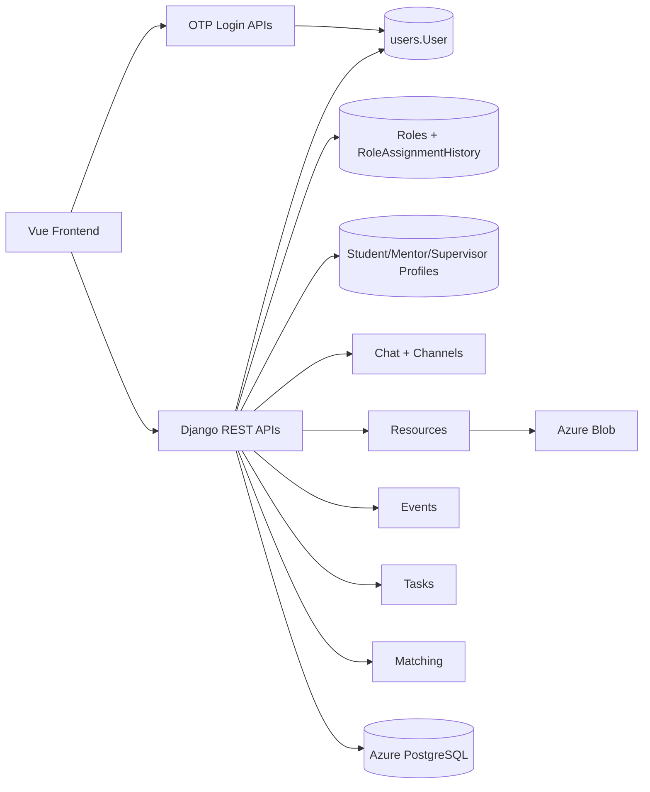
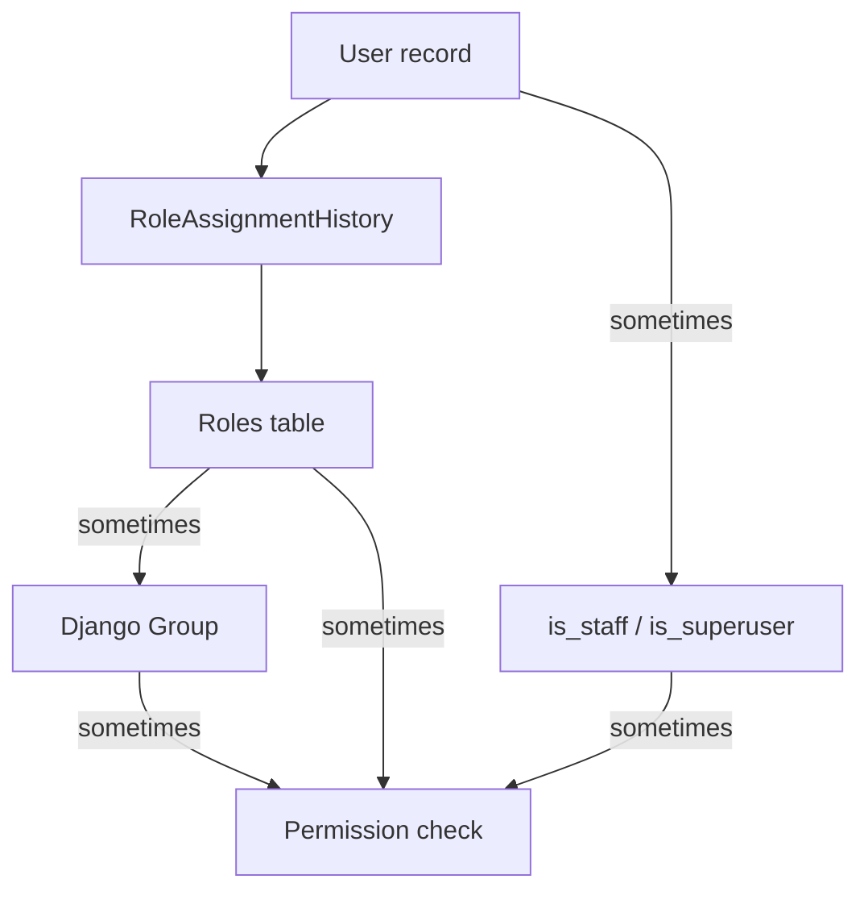
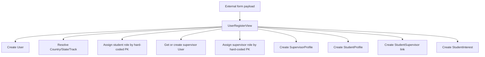
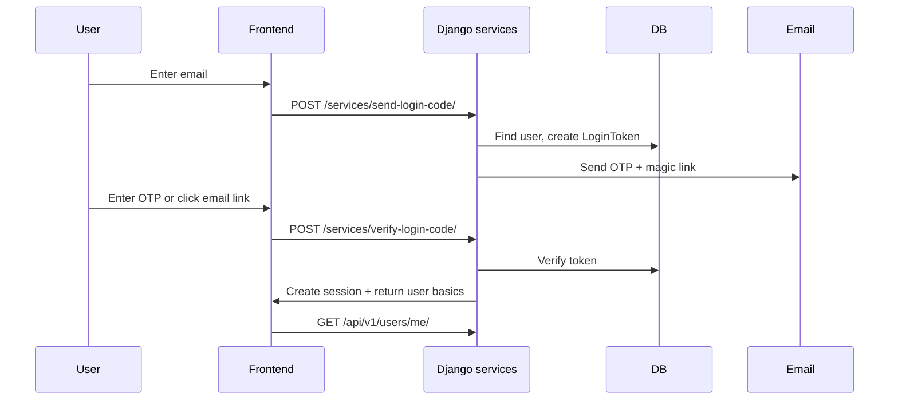
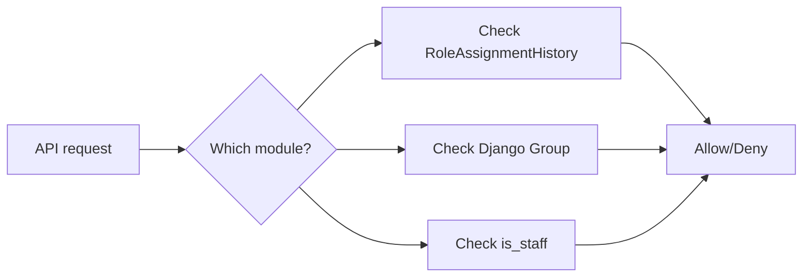
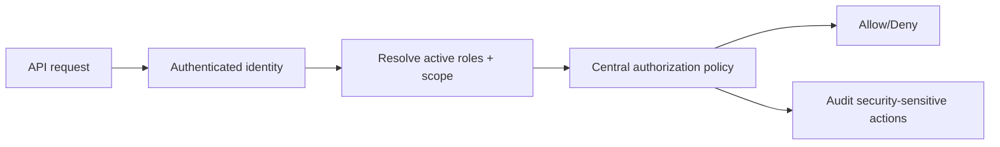
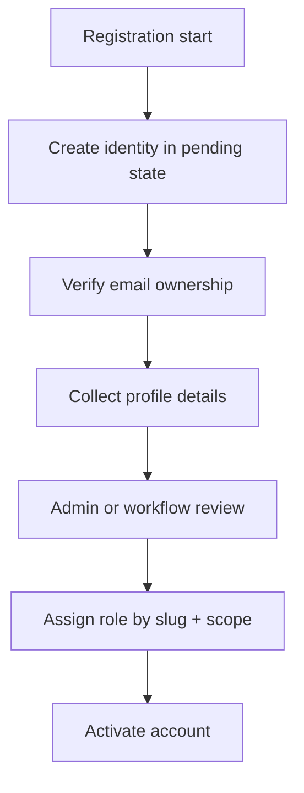

# Roles and User Onboarding Review

## Purpose

This document describes the current workflow for user onboarding, authentication,
roles, and RBAC in the BIOTech Futures mentoring platform codebase.

It is written as a takeover and recovery document:

- what exists today
- what appears to work
- what is broken or risky
- what should have been implemented instead
- what a best-practice target state should look like

## Scope

This review focuses on:

- user identity and onboarding
- role modelling
- RBAC enforcement
- related frontend assumptions

Primary code paths reviewed:

- `backend/apps/users`
- `backend/apps/resources`
- `backend/apps/services`
- `backend/apps/events`
- `backend/apps/chat`
- `frontend/src/stores/auth.ts`

## Executive Summary

The current system has the basic building blocks for a mentoring platform:

- a custom `User` model
- profile tables for students, mentors, and supervisors
- a custom `Roles` table with `RoleAssignmentHistory`
- passwordless email OTP login using Django sessions
- some role-aware API behavior in chat, resources, and events

However, the implementation is not production-safe in its current form.

Key issues:

- onboarding mixes external form ingestion with direct identity creation
- role assignment is mutable through unsafe endpoints
- role names and enforcement logic are inconsistent across modules
- there is no implemented Local Administrator vs Global Administrator model
- business roles, Django groups, and `is_staff` are used interchangeably
- the frontend assumes role behavior that the backend does not enforce consistently

## Current Tech Stack

| Layer | Current implementation | Notes |
|---|---|---|
| Frontend | Vue 3, Vite, Pinia, TypeScript | Frontend builds successfully; role checks are lightweight and partly UI-only |
| Backend API | Django 5.2, Django REST Framework | Main runtime uses `config.settings` |
| Realtime chat | Django Channels | Currently configured with in-memory channel layer, not production-ready |
| Authentication | Email OTP + Django session cookie | Implemented in `apps.services` |
| Role model | `Roles` + `RoleAssignmentHistory` + partial Django `Group` sync | No single authoritative RBAC implementation |
| Data store | Azure PostgreSQL in `config.settings`; SQLite in legacy `core.settings` | Split runtime/testing setup |
| File storage | Azure Blob Storage | Credentials currently hardcoded |
| Legacy/parallel project | `backend/core` + `matching` | Indicates architectural drift |

## Current Architecture at a Glance

## Current Role Model

### Data Model

The current role-related design is split across three concepts:

1. `users.User`
2. `resources.Roles`
3. `resources.RoleAssignmentHistory`

There is also partial use of Django auth groups and `is_staff`.

### What exists

- Custom `User` model keyed by email
- `AdminProfile`
- `StudentProfile`
- `MentorProfile`
- `SupervisorProfile`
- `Roles`
- `RoleAssignmentHistory`
- role services to grant/revoke roles and sync Django groups

### What is missing

- explicit `local_admin` role
- explicit `global_admin` role
- scoped admin authority by school/track/state/region
- a single canonical role enum or slug set
- a single canonical authorization service used by all APIs

### Current Role Workflow

### Why this is a problem

The system currently has three competing authorization signals:

- business role from `RoleAssignmentHistory`
- Django auth group membership
- Django `is_staff` / `is_superuser`

This creates drift. A user can be "admin" in one part of the system and not in another.

## Current User Onboarding Workflow

### Student registration flow

The primary onboarding endpoint is effectively a direct ingestion endpoint for an external form payload.

Current behavior:

1. Accept `request.data["body"]`
2. Create a `User`
3. Derive track/state from country + region
4. Create a student role assignment using hard-coded role PK `4`
5. Auto-create or fetch supervisor `User`
6. Create supervisor role assignment using hard-coded role PK `2`
7. Create `SupervisorProfile`
8. Create `StudentProfile`
9. Create `StudentSupervisor`
10. Create `StudentInterest`

### Current student onboarding workflow

### Join permission flow

There is a second endpoint that updates join permission on an existing student profile.

Current behavior:

1. Look up `User` by submitted email
2. Look up `StudentProfile`
3. Set `has_join_permission=True`
4. Save `joinperm_responseID`

This appears to be intended for parent/guardian consent capture.

### Authentication flow

Authentication is separate from registration.

Current behavior:

1. User submits email to `send-login-code`
2. If user exists, create a `LoginToken`
3. Email a 6-digit OTP and magic link
4. User submits OTP or clicks magic link
5. Backend verifies token and creates Django session
6. Frontend calls `/api/v1/users/me/`

### Current login flow

## User Stories Review

### 1. As a student, I can register for the mentoring platform

#### What is working

- Student-related tables exist
- A student registration endpoint exists
- Track and state can be derived from submitted country/region
- Student interest and supervisor relationship records can be created

#### What is not working

- The `User` is created with `email=databody["Title"]`, which is clearly not a reliable identity field
- The API contract is tied to one incoming payload format rather than a stable backend DTO
- The role is assigned by hard-coded database PK rather than role slug
- Guardian logic is computed but not actually used consistently
- There is no verified email ownership step before account activation
- There is no approval or moderation stage for student activation

#### What should have been done

- Define a dedicated `StudentRegistrationSerializer`
- Validate fields explicitly and return structured errors
- Use a stable role key, for example `student`
- Separate identity creation from profile completion
- Require verified email ownership before activation
- Add lifecycle states such as `pending`, `verified`, `approved`, `active`

### 2. As a mentor, I can join the platform and be approved for mentoring

#### What is working

- `MentorProfile` exists in the main app
- `matching.Mentor` exists in the legacy matching app
- Matching logic can assign mentors to groups in the legacy path

#### What is not working

- There is no clear mentor onboarding API in the main backend equivalent to student registration
- Mentor domain logic is split across two separate models in different app domains
- Legacy matching tests and import flows still expect fields that no longer match the model cleanly
- There is no visible approval workflow for mentor activation in the main app

#### What should have been done

- Keep one mentor domain model in one bounded context
- Add a mentor application endpoint with approval state
- Store qualifications, capacity, interests, and verification status in one coherent flow
- Expose an admin review queue for mentor approval/rejection

### 3. As a supervisor, I can be linked to a student and access permitted features

#### What is working

- `SupervisorProfile` exists
- `StudentSupervisor` relationship exists
- Event permissions attempt to allow supervisor access

#### What is not working

- Supervisors are auto-created from student-submitted data without identity proof
- There is no supervisor invite-and-claim flow
- There is no clear distinction between guardian and school supervisor beyond a simple relationship type string
- Downstream permissions for supervisors are inconsistent across modules

#### What should have been done

- Create supervisor records only through invite + acceptance
- Support verified claim of identity
- Distinguish guardian contact from school supervisor account
- Limit supervisor visibility by actual linked students/groups

### 4. As a local administrator, I can manage users within my program scope

#### What is working

- A generic admin concept exists
- Some endpoints allow admin-only actions

#### What is not working

- There is no `local_admin` role
- There is no scope model for school, track, region, or cohort
- Many admin checks rely on `is_staff`, not business role assignment
- Frontend admin experience is still mock data

#### What should have been done

- Define `local_admin` explicitly
- Add scope fields to the admin assignment model
- Centralize policy checks like `can_manage_user(actor, target)`
- Build real admin APIs and bind the frontend to them

### 5. As a global administrator, I can manage the whole platform

#### What is working

- Django `is_staff` / `is_superuser` can unlock some platform-level behavior

#### What is not working

- There is no explicit `global_admin` role in the business model
- No audit boundary exists between local and global powers
- Admin rights are not resolved consistently across chat, resources, events, and frontend UI

#### What should have been done

- Define `global_admin` as a first-class role
- Keep global powers separate from local powers
- Add audit logs for role grants, suspensions, reassignment actions, and bulk operations

### 6. As a returning user, I can log in and receive the correct permissions

#### What is working

- OTP login exists
- Session creation works conceptually
- `/users/me/` returns the current active role metadata

#### What is not working

- The auth flow exposes whether a user exists
- There is no visible throttling/rate limiting
- Frontend role checks are lightweight and not authoritative
- The session-based flow coexists with old token-oriented assumptions in frontend state

#### What should have been done

- Add rate limiting and anti-enumeration responses
- Return uniform responses from login-initiation endpoints
- Keep frontend role display separate from backend authorization
- Use one auth strategy only

### 7. As the system, I can enforce RBAC consistently across APIs

#### What is working

- Resources has role-aware filtering
- Chat has group membership checks
- Events has role-aware access logic

#### What is not working

- User endpoints can mutate roles unsafely
- Some modules use business roles
- Some modules use Django `Group`
- Some modules use `is_staff`
- Role names are inconsistent: `admin`, `administrator`, `basic_user`, `basic_student`

#### What should have been done

- Create one authorization service layer
- Use canonical role slugs everywhere
- Remove direct role mutation from general user endpoints
- Make role grant/revoke admin-only and fully audited

## Current vs Best-Practice Role Workflow

### Current state

### Best-practice target state

## Best-Practice Target Onboarding Design

### Recommended onboarding phases

1. Identity invitation or self-registration
2. Email verification / SSO confirmation
3. Profile completion
4. Role approval and scope assignment
5. Activation

### Target onboarding workflow

## What Should Have Been Done Architecturally

### Roles

- one canonical role catalog
- explicit `student`, `mentor`, `supervisor`, `local_admin`, `global_admin`
- optional secondary roles only if business rules require them
- explicit scope for admin assignments

### Onboarding

- serializer-driven validation
- idempotent API contracts
- activation states
- invitation and claim flows for supervisors/admins
- approval queue for mentors and possibly students

### RBAC

- one policy source of truth
- no role changes through generic profile endpoints
- role grant/revoke endpoints restricted to authorized admins
- audit logs for role and status changes

### Frontend

- UI role checks are presentation only
- backend remains authoritative
- admin pages bound to real APIs, not mocks

## Recovery Recommendations

### Immediate

1. Remove public role mutation paths.
2. Replace hard-coded role PK usage with role slugs.
3. Redesign the student registration endpoint contract.
4. Introduce canonical role constants used across backend and frontend.

### Near-term

1. Add dedicated onboarding serializers and service objects.
2. Add account lifecycle states.
3. Add scoped admin roles.
4. Normalize role checks across resources, chat, events, and frontend assumptions.

### Strategic

1. Retire the split between `config` and `core` or explicitly separate them.
2. Move to a single documented identity and authorization architecture.
3. Add automated tests for onboarding, role assignment, and authorization by role.

## Final Assessment

The current implementation is best described as:

- partially built
- structurally promising
- not safe enough yet for real production operation

The codebase contains enough pieces to recover, but the team should treat
roles and onboarding as a redesign-and-hardening stream, not as a light patching task.
