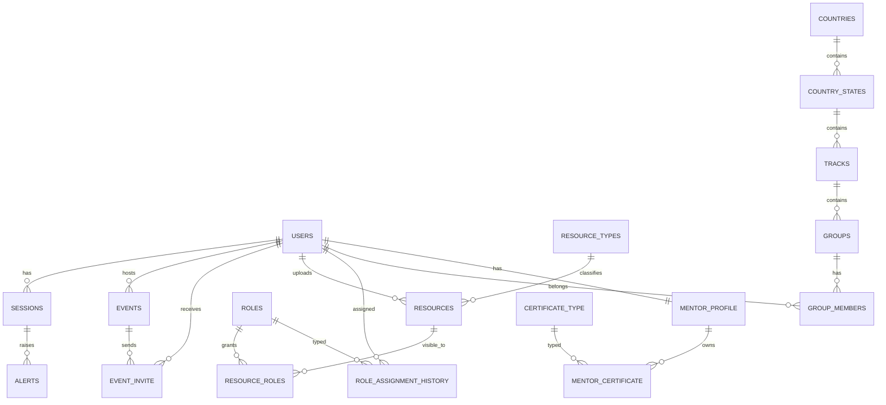
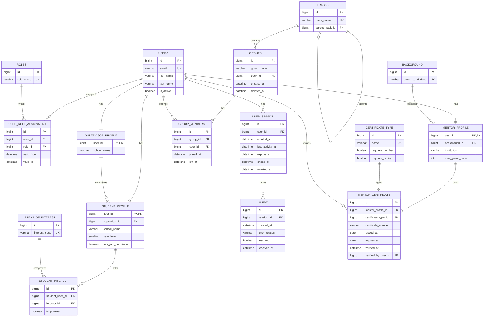

# Database Schema Review And ERD

## Scope

This document reviews the Django database schema that is currently implemented in `backend/apps/*`.

It covers:

- the schema shape before the March 21, 2026 fix
- the schema shape after the fix
- what was wrong in the previous design
- what was fixed
- what is still not ideal
- what a better target schema should look like

This review focuses on the parts of the schema that were involved in the defect and on the surrounding data-model design:

- users and profiles
- countries, states, tracks, groups
- role assignment and resources
- events and invites
- mentor certificates
- sessions and alerts

## Executive Summary

The previous schema had one concrete database-design error:

- it encoded time-relative business rules as database `CHECK` constraints using `Now()`

That pattern is not portable and is not a good fit for relational constraints because:

- it depends on wall-clock time instead of only row values
- SQLite rejects it as a non-deterministic check
- even on databases that allow it, the rule is not a stable row invariant

The fix removed those time-relative constraints from the schema and moved the time-based rules into application validation.

That fix is correct and is a best-practice improvement for this specific problem.

However, the overall schema is still not ideal. The main structural issues that remain are:

- duplicated concepts across `matching` and the main `apps.*` schema
- redundant user geography fields (`user.track` and `user.state`)
- redundant student-interest modeling (`student_profile.interest` and `student_interest`)
- a session model that stores login state as a boolean instead of session lifecycle timestamps
- a role/profile model that mixes role history and separate one-to-one profile tables without a clearly enforced lifecycle

## Previous Schema ERD

This ERD shows the relevant schema shape before the fix. The relationships were mostly acceptable. The defect was in the constraints, not the foreign-key graph.

```mermaid
erDiagram
    USERS {
        bigint id PK
        varchar email UK
        varchar first_name
        varchar last_name
        bigint track_id FK
        bigint state_id FK
        boolean status
    }

    ADMIN_PROFILE {
        bigint admin_id PK,FK
    }

    SUPERVISOR_PROFILE {
        bigint user_id PK,FK
        varchar school_name
    }

    MENTOR_PROFILE {
        bigint user_id PK,FK
        bigint background_id FK
        varchar institution
        varchar mentor_reason
        int max_grp_cnt
    }

    STUDENT_PROFILE {
        bigint user_id PK,FK
        varchar pg_first_name
        varchar pg_last_name
        boolean parent_guardian_flag
        bigint supervisor_id FK
        bigint interest_id FK
        varchar school_name
        varchar year_lvl
        boolean has_join_permission
        varchar joinperm_responseID
    }

    AREAS_OF_INTEREST {
        bigint id PK
        varchar interest_desc
    }

    STUDENT_INTEREST {
        bigint id PK
        bigint user_id FK
        bigint interest_id FK
    }

    RELATIONSHIP_TYPE {
        bigint relationship_type_id PK
        varchar relationship_type UK
    }

    STUDENT_SUPERVISOR {
        bigint id PK
        bigint student_user_id FK
        bigint supervisor_user_id FK
        bigint relationship_type_id FK
    }

    BACKGROUND {
        bigint id PK
        text background_desc_unique_field
    }

    COUNTRIES {
        bigint id PK
        varchar country_name
    }

    COUNTRY_STATES {
        bigint id PK
        bigint country_id FK
        varchar state_name
    }

    TRACKS {
        bigint id PK
        varchar track_name UK
        bigint state_id FK
    }

    GROUPS {
        bigint id PK
        varchar group_name
        bigint track_id FK
        datetime creation_datetime
        boolean deleted_flag
        datetime deleted_datetime
    }

    GROUP_MEMBERS {
        bigint id PK
        bigint group_id FK
        bigint user_id FK
    }

    ROLES {
        bigint id PK
        varchar role_name UK
    }

    ROLE_ASSIGNMENT_HISTORY {
        bigint id PK
        bigint user_id FK
        bigint role_id FK
        datetime valid_from
        datetime valid_to
    }

    RESOURCE_TYPES {
        bigint id PK
        varchar type_name UK
    }

    RESOURCES {
        bigint id PK
        varchar resource_name
        varchar resource_description
        bigint resource_type_id FK
        bigint uploader_user_id FK
        datetime upload_datetime
        boolean deleted_flag
        datetime deleted_datetime
    }

    RESOURCE_ROLES {
        bigint id PK
        bigint resource_id FK
        bigint role_id FK
    }

    EVENTS {
        bigint id PK
        varchar event_name
        datetime start_datetime
        datetime ends_datetime
        bigint host_user_id FK
        boolean deleted_flag
        datetime deleted_datetime
        boolean is_virtual
    }

    EVENT_INVITE {
        bigint id PK
        bigint event_id FK
        bigint user_id FK
        datetime sent_datetime
        boolean attendance_status
        boolean rsvp_status
    }

    CERTIFICATE_TYPE {
        bigint id PK
        varchar certificate_type UK
        boolean requires_number
        boolean requires_expiry
    }

    MENTOR_CERTIFICATE {
        bigint id PK
        bigint mentor_profile_id FK
        bigint certificate_type_id FK
        varchar certificate_number
        varchar issued_by
        date issued_at
        date expires_at
        varchar file_url
        boolean verified
    }

    SESSIONS {
        bigint id PK
        bigint user_id FK
        datetime access_datetime
        boolean isLoggedin
    }

    ALERTS {
        bigint id PK
        bigint session_id FK
        datetime alert_timestamp
        varchar error_reason
        boolean resolved
    }

    USERS ||--|| ADMIN_PROFILE : has
    USERS ||--|| SUPERVISOR_PROFILE : has
    USERS ||--|| MENTOR_PROFILE : has
    USERS ||--|| STUDENT_PROFILE : has
    BACKGROUND ||--o{ MENTOR_PROFILE : classifies
    SUPERVISOR_PROFILE ||--o{ STUDENT_PROFILE : supervises
    AREAS_OF_INTEREST ||--o{ STUDENT_PROFILE : primary_interest
    USERS ||--o{ STUDENT_INTEREST : has
    AREAS_OF_INTEREST ||--o{ STUDENT_INTEREST : links
    STUDENT_PROFILE ||--o{ STUDENT_SUPERVISOR : assigned
    SUPERVISOR_PROFILE ||--o{ STUDENT_SUPERVISOR : linked
    RELATIONSHIP_TYPE ||--o{ STUDENT_SUPERVISOR : typed
    COUNTRIES ||--o{ COUNTRY_STATES : contains
    COUNTRY_STATES ||--o{ TRACKS : contains
    TRACKS ||--o{ USERS : assigned
    COUNTRY_STATES ||--o{ USERS : assigned
    TRACKS ||--o{ GROUPS : contains
    GROUPS ||--o{ GROUP_MEMBERS : has
    USERS ||--o{ GROUP_MEMBERS : belongs
    USERS ||--o{ ROLE_ASSIGNMENT_HISTORY : assigned
    ROLES ||--o{ ROLE_ASSIGNMENT_HISTORY : assigned
    RESOURCE_TYPES ||--o{ RESOURCES : classifies
    USERS ||--o{ RESOURCES : uploads
    RESOURCES ||--o{ RESOURCE_ROLES : visible_to
    ROLES ||--o{ RESOURCE_ROLES : allowed
    USERS ||--o{ EVENTS : hosts
    EVENTS ||--o{ EVENT_INVITE : sends
    USERS ||--o{ EVENT_INVITE : receives
    MENTOR_PROFILE ||--o{ MENTOR_CERTIFICATE : owns
    CERTIFICATE_TYPE ||--o{ MENTOR_CERTIFICATE : typed
    USERS ||--o{ SESSIONS : has
    SESSIONS ||--o{ ALERTS : raises
```

### Previous schema-only defects

The broken part of the previous design was the use of time-relative `CHECK` constraints:

- `groups.group_creation_not_future`
- `resources.resource_upload_not_future`
- `event_invite.check_invite_sent_datetime_not_future`
- `sessions.access_not_in_future`
- `mentor_certificate.cannot_verify_expired_certificate`

Those rules depended on `Now()` and therefore on database clock time.

## Fixed Schema ERD

The relational shape after the fix is almost the same. The important change is where time-relative rules are enforced.

### Fixed rule placement

After the fix:

- deterministic row invariants stay in database constraints
- time-relative rules moved to serializer or view validation

That means:

- row-shape rules like uniqueness, non-empty strings, and timestamp ordering remain in the schema
- clock-sensitive rules like "not in the future" and "cannot verify expired certificate" are enforced in application logic

### Fixed migrations

The fix removed the broken constraints with these migrations:

- `apps/groups/migrations/0003_remove_groups_group_creation_not_future.py`
- `apps/resources/migrations/0009_remove_resources_resource_upload_not_future.py`
- `apps/events/migrations/0003_remove_eventinvite_check_invite_sent_datetime_not_future.py`
- `apps/user_sessions/migrations/0005_remove_sessions_access_not_in_future.py`
- `apps/certificates/migrations/0005_remove_mentorcertificate_cannot_verify_expired_certificate.py`

## What Was Wrong

### 1. Time-dependent rules were stored as schema constraints

This was the concrete defect.

Examples:

- `creation_datetime <= NOW()`
- `upload_datetime <= NOW()`
- `access_datetime <= NOW()`
- `expires_at >= NOW() OR verified = false`

Why this is wrong:

- a relational `CHECK` should express a stable invariant of the row
- the truth of these expressions changes with time even when the row does not change
- SQLite forbids non-deterministic expressions in check constraints
- conditional model logic based on `connection.vendor` creates migration drift and environment inconsistency

### 2. Student interest is modeled twice

The current schema has both:

- `student_profile.interest`
- `student_interest(user, interest)`

That is redundant unless one has a clearly different meaning such as `primary_interest`.

Current risk:

- duplicated data
- ambiguous source of truth
- inconsistent reads and writes

### 3. User geography is redundant

The current `users` table stores both:

- `track_id`
- `state_id`

But `track` already points to `state`.

Current risk:

- user rows can hold mismatched `track` and `state`
- the schema does not enforce consistency between them
- every consumer must guess which one is authoritative

### 4. Session design is too weak for real session lifecycle management

The current session table is:

- `user_id`
- `access_datetime`
- `isLoggedin`

This is not a robust session model.

Current risk:

- `isLoggedin` can drift from reality
- there is no expiry, revocation, or logout timestamp
- there is no last-activity tracking
- multiple device sessions are hard to reason about

### 5. Roles and profiles are only partially aligned

The schema uses:

- role history in `role_assignment_history`
- one-to-one profile tables such as `mentor_profile`, `student_profile`, `supervisor_profile`

This is workable, but the lifecycle is not very explicit.

Current risk:

- profile existence and active role can diverge
- code has to infer whether role assignment or profile table is the source of truth
- annual refreshes become harder to manage cleanly

### 6. The repo contains two competing schema directions

There is a legacy or parallel `matching` app with its own student, mentor, interest, and grouping model set.

This is not a database defect by itself, but it is a schema-governance problem.

Current risk:

- duplicated concepts
- confusing migrations and tests
- competing sources of truth

## What Was Fixed

The fix addressed the concrete database-design error.

### Removed from schema

The following rules are no longer implemented as database `CHECK` constraints:

- group creation time must not be in the future
- resource upload time must not be in the future
- invite sent time must not be in the future
- session access time must not be in the future
- expired certificates must not be verified

### Moved to application validation

These rules are now enforced where they belong:

- certificate verification is checked in the certificate serializer and verify action
- event invite sent time validation is done in serializer logic
- the other timestamp rules can be validated in serializer, service, or view code when those write paths are introduced

### Why this fix is better

- it works on SQLite and PostgreSQL
- migrations are stable across environments
- business rules remain explicit
- deterministic integrity rules remain in the database

## Is The Fixed Schema Best Practice?

For the specific defect: yes.

For the overall schema: not yet.

The fixed schema is safer than the previous schema, but it still falls short of best practice in several places.

Best practice is:

- database constraints for deterministic row invariants
- application validation or domain services for time-relative workflow rules
- one source of truth for each business concept
- no redundant foreign keys unless consistency is explicitly enforced
- session state derived from lifecycle timestamps, not a boolean snapshot
- one canonical domain model for students, mentors, groups, and roles

## Recommended Target Schema

This is the direction that would be closer to best practice.

## Recommended Changes Vs Current Design

### 1. Make `track` the single geography link on user-facing tables

Current:

- `users.track`
- `users.state`

Recommended:

- keep only `users.track`
- derive state from `track`
- if you need hierarchy, give `tracks` a `parent_track_id`

### 2. Keep only one student-interest model

Current:

- `student_profile.interest`
- `student_interest`

Recommended:

- remove `student_profile.interest`
- keep only `student_interest`
- add `is_primary` if a primary interest is needed

### 3. Replace `isLoggedin` with lifecycle timestamps

Current:

- `sessions.access_datetime`
- `sessions.isLoggedin`

Recommended:

- `created_at`
- `last_activity_at`
- `expires_at`
- `ended_at`
- `revoked_at`

Then compute active state instead of storing it as a mutable boolean.

### 4. Keep database constraints deterministic

Good candidates for DB constraints:

- unique email
- `deleted_at >= created_at`
- `valid_to >= valid_from`
- unique `(group_id, user_id)`
- unique `(mentor_profile_id, certificate_type_id, certificate_number)`

Bad candidates for DB constraints:

- not in the future
- expires after today
- currently active right now
- role is current based on wall-clock time

These should live in application validation, services, or database triggers if you intentionally want database-enforced workflow logic.

### 5. Add audit fields to workflow-heavy tables

Recommended examples:

- `mentor_certificate.verified_at`
- `mentor_certificate.verified_by_user_id`
- `group_members.joined_at`
- `group_members.left_at`
- `alerts.resolved_at`

### 6. Consolidate the domain model

Choose one canonical model family for:

- users
- mentors
- students
- interests
- groups
- matching

The `matching` app should either:

- become a pure read or service layer over the canonical schema, or
- be retired and migrated into the main app schema

## Practical Recommendation

Short term:

1. Keep the March 21, 2026 fix as-is.
2. Do not reintroduce `Now()`-based schema constraints.
3. Treat application validation as the correct place for time-relative rules.

Medium term:

1. Remove redundant `student_profile.interest` or redefine it explicitly as `primary_interest`.
2. Remove `users.state` or enforce it from `users.track`.
3. Redesign `sessions` around lifecycle timestamps.

Long term:

1. Unify the schema direction between `matching` and the main apps.
2. Move toward a single canonical user-role-profile model.
3. Treat tracks as a first-class hierarchy if geography and permissions depend on them.

## Conclusion

The previous schema was broken because it used time-relative expressions as relational constraints.

The fixed schema is correct for that defect and is a clear improvement.

But the current schema is still transitional rather than final. It is serviceable, but it is not the cleanest target design yet. The next meaningful improvements are not more database checks; they are:

- removing redundant data paths
- clarifying the source of truth for roles and geography
- redesigning sessions as lifecycle records
- consolidating overlapping domain models
