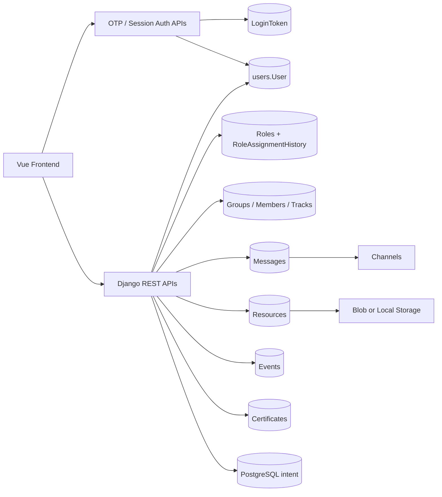
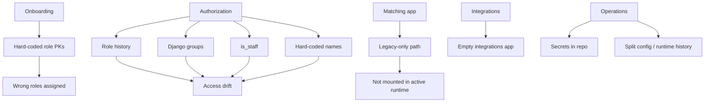
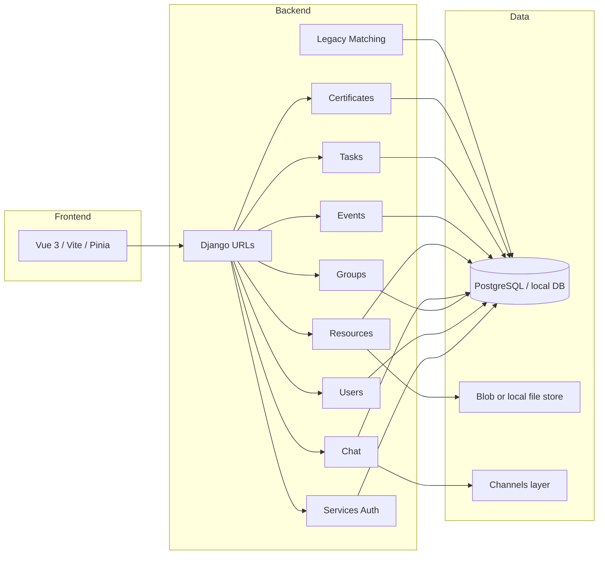
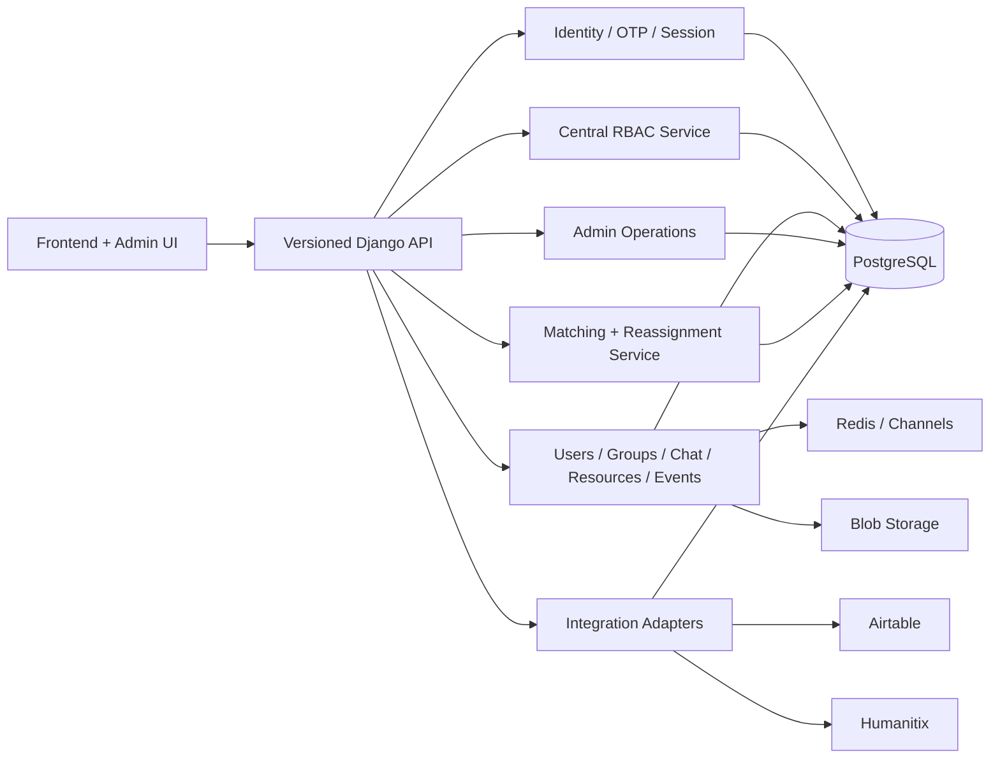
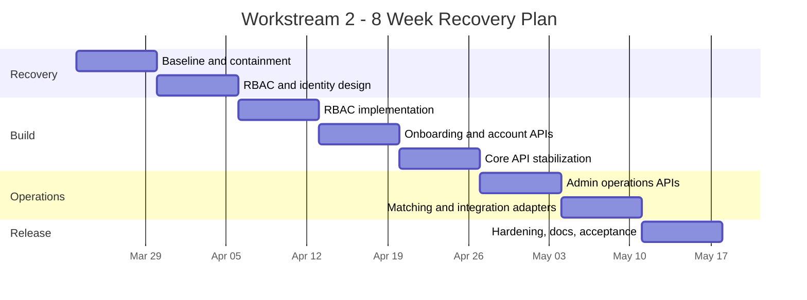

# Workstream 2 Delivery Recovery Assessment

## Purpose

This document assesses [scopeAndDeliverables.md](../../../scopeAndDeliverables.md) against the actual backend and API state of this repository.

It answers:

- what from last year's scope appears implemented
- what is only partial, legacy, or missing
- how the current backend is structured
- what the dev team should do next
- what a realistic 8-week Workstream 2 outcome looks like
- what weekly milestones should be used to recover delivery

## Assumptions

- This assessment is for Workstream 2 only: backend services, APIs, authentication, RBAC, schema, matching/reassignment services, and backend-facing integrations.
- Frontend UX, visual design, and broader Azure platform work are dependencies, but not the primary output of this plan.
- The repo reviewed is the current source of truth, even where documentation and runtime history are inconsistent.

## Executive Summary

The backend is not a greenfield failure. It already contains a usable core:

- Django 5.2 + DRF backend
- custom `User` model
- OTP/passwordless login with Django sessions
- groups, chat, resources, events, certificates, tasks, and role history models
- generated OpenAPI pages

However, the codebase is in delivery-recovery territory, not MVP-ready backend territory.

The main blockers are:

- unsafe RBAC and privilege escalation
- broken onboarding and hard-coded role PK assumptions
- schema/runtime drift caused by legacy and parallel project history
- incomplete integrations and automation
- legacy matching code not mounted in the active runtime
- inconsistent role enforcement across modules

The realistic goal for an 8-week Workstream 2 is not “finish every idea from last year's scope”. The realistic goal is:

1. stabilize backend architecture
2. secure identity, roles, and onboarding
3. make the core APIs reliable and testable
4. deliver a deterministic matching/reassignment v1
5. hand over a backend that can actually support frontend/admin work

## Original Scope Assessment

| Original deliverable / task | Repo evidence | Status | Assessment |
|---|---|---|---|
| Scalable, secure, cloud-hosted core system with public/private APIs | Django backend exists; Azure settings exist; OpenAPI pages exist | Partial | “Core system” exists, but “secure” and “cloud-hosted” are not in a production-ready state because secrets are hardcoded, local/runtime config is inconsistent, and authorization is unsafe. |
| Passwordless login service (email code, short expiry) | `apps.services`, `LoginToken`, OTP verification and magic link flow | Partial | OTP works locally and uses short-expiry codes, but callback flow is out of sync with the frontend and login leaks whether users exist. |
| User management and role-based permissions | `apps.users`, `apps.resources`, `RoleAssignmentHistory` | Partial / risky | Role model exists, but enforcement is inconsistent and unsafe. Direct user endpoints allow role mutation and status updates. |
| Database schema for users, groups, resources, and messages | Main apps exist for all of these | Partial | The schema exists, but it is not cleanly governed: there is project drift, legacy parallel models, and inconsistent role semantics. |
| Tracks and group structures | `apps.groups` | Implemented successfully at basic level | Countries, states, tracks, groups, and group members exist and basic CRUD works. |
| Chat service (native or integrated provider) | `apps.chat` + Channels | Implemented successfully at basic level | Group message list/post/delete works. Real file-sharing flow is still incomplete. |
| Resource library storage with role-based access | `apps.resources` | Partial | Resource CRUD and role visibility exist, but permission logic is inconsistent and a role filter path crashes. |
| Profile import/export (Airtable integration) APIs | `apps.integrations` is empty | Not implemented successfully | Integration surface is declared in scope, but no real implementation exists in the active runtime. |
| Group and message retrieval APIs | groups/chat routes | Implemented successfully at basic level | Read APIs exist and work in local smoke testing. |
| Resource retrieval and upload APIs | resources routes | Implemented successfully at basic level | Retrieval and creation work; admin-only mutation patterns exist but need cleanup. |
| Account activation/deactivation functions | `status` field and patch endpoints on users | Partial / risky | Activation/deactivation exists only as an unsafe field mutation pattern, not as a controlled admin workflow. |
| APIs to Workstream 1 (UI) and Workstream 3 (admin automation) | endpoint surface exists | Partial | There is enough API surface to support UI work, but not enough reliability or RBAC consistency to support admin automation safely. |
| Airtable integration | integration placeholder only | Not implemented successfully | No active implementation. |
| Humanitix integration | events references only | Not implemented successfully | There is an event model and `humanitix_link`, but not an actual integration. |
| Administrator functions: automated student team formation and mentor assignment | legacy `matching` app | Legacy only / partial | Matching exists, but it is not integrated into the active `config` runtime and is internally inconsistent. |
| Group reassignment tools with automated email triggers | fragments only | Not implemented successfully | No complete operational workflow in active runtime. |
| Admin-only content creation with role-based visibility | resources admin-only mutation pattern | Partial | Content creation and role assignment exist, but admin scope and RBAC are not robust enough yet. |
| Import/export user data APIs | not complete in active runtime | Not implemented successfully | No clean import/export contract suitable for real operations. |

## What Has Been Implemented Successfully

These areas are usable starting points and should be preserved rather than rewritten.

### 1. OTP Passwordless Authentication Core

What exists:

- `send-login-code`
- `verify-login-code`
- `magic` login path
- `LoginToken` model with expiry and single-use behavior
- Django session-based auth

Why this counts as implemented:

- The fundamental login mechanism exists and works locally
- This is a valid basis for a production passwordless flow after hardening

### 2. Core Domain Models

What exists:

- `User`
- `StudentProfile`, `MentorProfile`, `SupervisorProfile`
- `Roles`, `RoleAssignmentHistory`
- `Countries`, `CountryStates`, `Tracks`, `Groups`, `GroupMembers`
- `Messages`, `Resources`, `Events`, `Tasks`, `MentorCertificate`

Why this counts as implemented:

- The platform has actual domain structure, not just placeholders
- The backend is structurally close to an MVP, but not yet safe or coherent

### 3. Group, Chat, Resource, Event, and Certificate APIs

What exists:

- group list/create/delete
- group member APIs
- chat list/post/delete
- resource list/create/update/delete/assign-role
- event list/create and invite list APIs
- certificate list/create/verify paths

Why this counts as implemented:

- These APIs are real, mounted, and callable
- They are good candidates for stabilization rather than replacement

### Current Working Path Diagram

## What Has Not Been Implemented Successfully

These are not “missing polish” items. They are backend recovery items.

### 1. Secure RBAC

Problem:

- role changes can be made through unsafe user endpoints
- different modules use different concepts of authority:
  - `RoleAssignmentHistory`
  - Django `Group`
  - `is_staff`
  - hard-coded role names
  - hard-coded role IDs

Impact:

- privilege escalation risk
- impossible to reason consistently about authorization
- impossible to certify admin behavior safely

### 2. Safe User Onboarding and Activation

Problem:

- onboarding is tied to one external payload shape
- it creates users before verified email ownership
- it auto-creates related users
- it assigns roles by database PK
- there is no proper invite / verification / approval lifecycle

Impact:

- wrong roles
- unreliable identity records
- no auditable activation flow

### 3. Matching and Reassignment in the Active Runtime

Problem:

- matching exists in a legacy module
- that module is not mounted in the active `config` runtime
- parts of it are already inconsistent with the rest of the domain model

Impact:

- one of the most important admin capabilities is not truly delivered

### 4. Integrations

Problem:

- `apps.integrations` is empty
- Airtable and Humanitix are not implemented as operational adapters

Impact:

- promised data exchange and event integration are not delivered

### 5. Delivery and Operational Readiness

Problem:

- secrets committed in source
- local setup historically inconsistent
- parallel project/runtime history (`core` vs `config`)
- no clean handover package

Impact:

- high operational risk
- difficult onboarding for new developers
- poor delivery predictability

### Current Failure Topology

## Current High-Level Backend Architecture

### Current Architecture

### Target Architecture for Recovery

## Best-Practice Recommendations For The Dev Team

## 0. Immediate Containment

These are day-1 recovery tasks, not optional backlog items.

1. Rotate all secrets currently committed in source.
2. Freeze any production deployment until RBAC and onboarding are secured.
3. Lock down unsafe user mutation endpoints immediately.
4. Decide that `config` is the active Django runtime and treat `core` as legacy unless explicitly revived.
5. Standardize local development on Postgres, not SQLite, for schema fidelity.

## 1. Identity And RBAC Recovery

1. Define a canonical role catalog:
   - `student`
   - `mentor`
   - `supervisor`
   - `local_admin`
   - `global_admin`
2. Remove all hard-coded role PK logic.
3. Remove self-service role mutation from general user endpoints.
4. Introduce controlled admin-only role assignment APIs with audit logging.
5. Define account lifecycle states:
   - `invited`
   - `pending_verification`
   - `pending_approval`
   - `active`
   - `deactivated`
6. Make `is_staff` and Django groups derived implementation details, not business authority.

## 2. Schema Recovery

1. Unify schema ownership under the active backend.
2. Remove or isolate legacy parallel models where they duplicate current domain concepts.
3. Normalize admin scope modelling for local/global administrators.
4. Add explicit schema migrations for corrected role lifecycle, onboarding states, and admin scope.
5. Keep database constraints that protect core invariants, but avoid runtime-vendor-specific model definitions.

## 3. Core API Stabilization

1. Define a stable API contract for users, groups, chat, resources, events, and certificates.
2. Replace unsafe or HTML-centric user endpoints with JSON APIs fit for frontend/admin use.
3. Add endpoint-level authorization tests by role.
4. Make create responses return usable resource identifiers consistently.
5. Add pagination, filtering, and validation behavior tests for all critical APIs.

## 4. Matching And Admin Automation Recovery

1. Decide whether to salvage or rewrite the legacy matching path.
2. Deliver a deterministic matching algorithm first, not an over-ambitious optimization engine.
3. Expose admin workflows for:
   - group formation
   - mentor assignment
   - mentor reassignment
   - bulk operations
   - communication trigger hooks
4. Ensure every automated action supports human override and auditability.

## 5. Integration Strategy

1. Do not promise full Airtable/Humanitix bidirectional sync in 8 weeks.
2. Deliver adapter interfaces plus one or two bounded flows:
   - profile import/export contract
   - event sync contract or Humanitix metadata link enrichment
3. Keep integrations idempotent and recoverable.

## 6. Operational Readiness

1. Move config to env vars / secret store.
2. Provide clean dev and test runbooks.
3. Provide OpenAPI docs for the agreed API contract.
4. Produce a handover package:
   - architecture overview
   - setup instructions
   - runbooks
   - known limitations
   - acceptance evidence

## Realistic Workstream 2 Deliverables For An 8-Week Project

These are the deliverables I would commit to for backend and APIs in the current repo state.

| Deliverable | Description | Acceptance Criteria | Implication Of Completion |
|---|---|---|---|
| D1. Secure Backend Baseline | Stabilized backend runtime, local Postgres path, environment-managed config, secrets removed from repo, active runtime clarified | Local dev and CI use one runtime; secrets rotated; backend boots cleanly; migrations apply cleanly on local Postgres; runbook updated | The team can safely develop and test against one backend instead of fighting environment drift |
| D2. Identity, Onboarding, And RBAC v2 | Passwordless auth hardened; onboarding redesigned; role assignment secured; local/global admin roles defined | No public role mutation; no self-admin escalation; onboarding uses serializers and lifecycle states; role checks use one shared authorization service; admin scope model exists | The platform becomes safe enough to support real users and admin workflows |
| D3. Core API Contract v1 | Stable, documented JSON APIs for users, groups, chat, resources, events, and certificates | OpenAPI reflects supported APIs; create/update/list flows pass tests; resource visibility works; chat group permissions work; unsafe legacy endpoints deprecated or replaced | Frontend and admin workstreams can build against a reliable backend contract |
| D4. Admin Operations API v1 | Bulk-capable backend workflows for group formation, mentor assignment/reassignment, account activation/deactivation, and bulk communications triggers | Admin-only endpoints exist; bulk operations are idempotent; audit events recorded; manual override supported; email trigger hooks defined | Workstream 3 has a backend capable of supporting actual admin operations |
| D5. Matching And Reassignment Service v1 | Deterministic matching service mounted in active runtime with overrideable rules and reassignment support | Matching endpoint/service is live in `config` runtime; test fixtures prove assignment and reassignment cases; result records are auditable | The project can credibly claim operational mentor allocation rather than only legacy prototype logic |
| D6. Integration-Ready Handover Package | Bounded Airtable/Humanitix integration contracts plus backend handover artifacts | Import/export contract delivered; Humanitix event linkage contract documented; deployment architecture documented; handover package completed | The backend can transition to live operation and subsequent phases without tacit knowledge loss |

## What Should Be Declared Out Of Scope Or Reduced

To keep the 8-week plan realistic, these should be reduced unless additional capacity appears:

- full microservice decomposition
- complete bi-directional Airtable synchronization
- advanced analytics dashboards
- embedded video conferencing
- calendar scheduling integration
- ambitious “smart” matching beyond deterministic rules + override

## 8-Week Project Plan And Milestones

| Week | Focus | Backend Milestone | Exit Criteria |
|---|---|---|---|
| Week 1 | Takeover, containment, environment recovery | Delivery recovery baseline | Secrets rotated or isolated; local Postgres dev path works; active runtime decision made; blocker list frozen |
| Week 2 | RBAC and identity design | Identity/RBAC design approved | Canonical role model, admin scope model, account lifecycle, and authorization policy agreed; migration plan approved |
| Week 3 | RBAC implementation | Unsafe auth paths removed | No self-role escalation; no public user mutation for sensitive fields; central authorization helper in place; tests started |
| Week 4 | Onboarding and user/account APIs | Onboarding v2 backend ready | Serializer-based onboarding flows implemented; activation/deactivation API implemented; user APIs converted to stable JSON contracts |
| Week 5 | Core API stabilization | Core API contract v1 | Groups/chat/resources/events/certificates aligned to shared RBAC; create responses normalized; OpenAPI updated; integration tests passing for critical flows |
| Week 6 | Admin operations | Admin operations v1 | Bulk group formation, mentor assignment/reassignment, and admin status management APIs available; audit trail and communication hooks defined |
| Week 7 | Matching and integrations | Matching/reassignment live in active runtime | Matching service mounted under `config`; deterministic rules tested; Airtable/Humanitix adapter contracts implemented or stubbed behind documented interfaces |
| Week 8 | Hardening, acceptance, handover | Workstream 2 release candidate | Regression pass complete; docs and handover package complete; acceptance evidence assembled; known limitations explicitly documented |

## Weekly Milestone Diagram

## Suggested Acceptance Gate For Workstream 2

Workstream 2 should only be declared “done” if all of the following are true:

1. Local dev, CI, and deployment runtime use the same migration lineage.
2. No user can escalate their role through user-facing endpoints.
3. Onboarding and activation are lifecycle-based and auditable.
4. Core APIs are documented, tested, and stable enough for dependent workstreams.
5. Matching/reassignment is live in the active runtime, not stranded in legacy code.
6. Admin operations required by the project are available through secured APIs.
7. The handover package lets a new engineer run, test, and reason about the backend without oral knowledge transfer.

## Final Recommendation

The right strategy is not to chase every historical promise equally.

The right strategy is:

1. secure the platform
2. stabilize the core backend
3. deliver deterministic admin and matching workflows
4. finish bounded integration-ready contracts
5. hand over a supportable backend platform

That is realistic in 8 weeks. A full “everything promised last year exactly as written” delivery is not realistic from the current repo state without reducing quality or accepting major production risk.

## Review Inputs

- [scopeAndDeliverables.md](../../../scopeAndDeliverables.md)
- `backend/apps/users`
- `backend/apps/resources`
- `backend/apps/groups`
- `backend/apps/chat`
- `backend/apps/events`
- `backend/apps/tasks`
- `backend/apps/certificates`
- `backend/apps/services`
- `backend/matching`
- `backend/config`
- existing recovery docs under `backend/non-project/docs`
